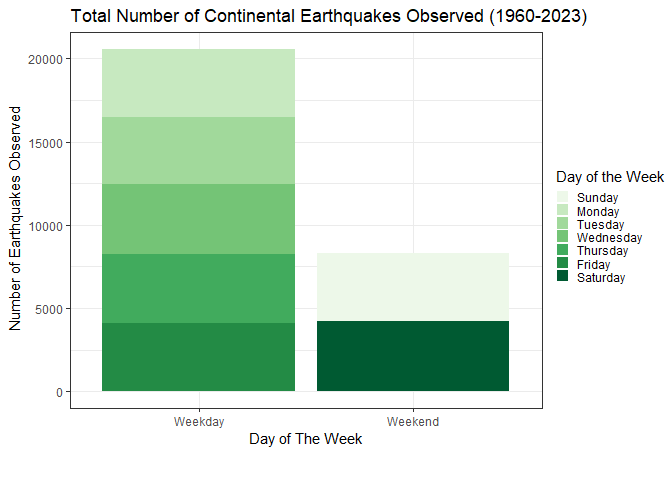

________________________________________________________________________________
## 1. Loading Things: \

##### 1.1: Loading Packages \
Load in any and all packages required to manipulate, transform, and illustrate 
the data given. 

```r
#Functional:
library(tidyverse)     #Package to process our data, stylized formation
```

```
## Warning: package 'tidyverse' was built under R version 4.3.2
```

```
## Warning: package 'purrr' was built under R version 4.3.2
```

```
## ── Attaching core tidyverse packages ──────────────────────── tidyverse 2.0.0 ──
## ✔ dplyr     1.1.3     ✔ readr     2.1.4
## ✔ forcats   1.0.0     ✔ stringr   1.5.0
## ✔ ggplot2   3.4.3     ✔ tibble    3.2.1
## ✔ lubridate 1.9.2     ✔ tidyr     1.3.0
## ✔ purrr     1.0.2     
## ── Conflicts ────────────────────────────────────────── tidyverse_conflicts() ──
## ✖ dplyr::filter() masks stats::filter()
## ✖ dplyr::lag()    masks stats::lag()
## ℹ Use the conflicted package (<http://conflicted.r-lib.org/>) to force all conflicts to become errors
```

```r
library(dplyr)         #Sub tidyverse package for data manipulation 
library(magrittr)      #Package to help coding sequencing 
```

```
## 
## Attaching package: 'magrittr'
## 
## The following object is masked from 'package:purrr':
## 
##     set_names
## 
## The following object is masked from 'package:tidyr':
## 
##     extract
```

```r
library(janitor)       #Package for 'clean_names()' function
```

```
## Warning: package 'janitor' was built under R version 4.3.2
```

```
## 
## Attaching package: 'janitor'
## 
## The following objects are masked from 'package:stats':
## 
##     chisq.test, fisher.test
```

```r
library(readr)         #Package to help parse rectangular data
library(stringr)       #Package to deal w/ NAs and manipulate cols/data
library(lubridate)     #Package for date processing and plotting
library(broom.mixed)   #Package to clean diverse model outputs
#Aesthetics:
library(ggplot2)       #Package to generate plotted data
library(patchwork)     #Package for extensive plotted data configuration 
```

```
## Warning: package 'patchwork' was built under R version 4.3.2
```

```r
library(ggthemes)      #Package for extra themes, scales, and geoms for plotted data
```

```
## Warning: package 'ggthemes' was built under R version 4.3.2
```

```r
library(RColorBrewer)  #Package to colour plots
library(viridis)       #Package to colour plots
```

```
## Loading required package: viridisLite
```

```
## Warning: package 'viridisLite' was built under R version 4.3.2
```

```r
library(here)          #Package to set working directory via `.Rproj`
```

```
## here() starts at C:/Users/jkoza/Documents/GRADUATE SCHOOL/2. COURSEWORK/GG606/GG606_Assignment_1
```

```r
getwd()                #Function to affirm working directory 
```

```
## [1] "C:/Users/jkoza/Documents/GRADUATE SCHOOL/2. COURSEWORK/GG606/GG606_Assignment_1"
```

##### 1.2: Loading Data \

```r
countries=read.csv(here("01_raw_data", "countries.csv"))   #load in datasets
earthquakes=read.csv(here("01_raw_data","earthquakes_5.5_1960-2023.csv")) 
```

________________________________________________________________________________
## 2. Manipulating Data: \
##### 2.1: Correcting The Main Dataset: \

Okay... soooo. A *lot* of stuff happened or tried to happen here. I have removed
all lines of code which did not end up working out. But relevant thought processes 
that stuck around: \

- Working with the time kinda messed with my mind. The format given to us is 
like so: 1960-01-02T12:21:58.720Z (YYYY-MM-DD Time(military): HH:MM:SSS (TimeZone UTC). But the Zulu UTC time was not in the proper format (ex: - 0800) in order to use 
`%z` or `%Z` in any date formatting sequences.. which is why I removed that last 
part of the time column. We are not using the time change for any data analysis
here, which is why it got cut, but should it have been needed we would have had to
continue figuring that out. \
- Another failed attempt: `mutate(time=as.POSIXct(time, format="%Y-%m-%dT%H:%M:%S.", tz="UTC"))` this was because I specified `time="1960-01-02T12:21:58"` in line 106 which applied this date to alll the data... (why filtering returned 0 rows)- went and looked at total data rows from `.csv` (matched) but then how many *specifically* were only from 1960 (527) + could not filter dates in environment. \
- Here `week_start` doesn't really matter because it is registering by character not 
numeric (ex: 1, 2, 3, etc.) and correctly identifies the weekday (changing or removing this piece of code does not have an impact on output).


```r
earthquakes=earthquakes %>%                     #overwrite previous dataset version
  clean_names() %>%                                          #clean all col headers
  mutate(time=str_extract(time, "[[:graph:]T[:graph:]]*(?<=[:punct:])")) %>%
  mutate(time=as.POSIXct(time, format="%Y-%m-%dT%H:%M:%S.", 
                         tz="UTC")) %>%                   #convert from chr to date
  mutate(date=as.Date(as.POSIXct(time, format="%Y-%m-%d %H:%M:%S", 
                         tz="UTC"))) %>%                      #convert to date type
  mutate(dayofweek=wday(ymd(date), label=TRUE, abbr=FALSE)) %>%            #Mon (1)
  mutate(country=str_extract(place, "(?<=[:graph:], )[:graph:]*")) %>% #get country
  mutate(year=year(date)) %>%                               #col solely for year
  mutate(month=month(date)) %>%                             #col solely for month
  group_by(year) %>%                          #only perform next calc w/ group var
  mutate(avg_mag=mean(mag, na.rm=TRUE)) %>%                    #yearly mag average 
  mutate(avg_mag_err=round(mean(mag_error, na.rm=TRUE), 2)) %>%
  select(time, date, year, country, dayofweek, mag, everything(), -nst, -gap,-dmin, 
       -rms, -net, -id, -updated, -mag_nst, -status, -location_source, -mag_source) %>%
print()                                      #View object created appears properly 
```

```
## # A tibble: 28,835 × 18
## # Groups:   year [64]
##    time                date        year country   dayofweek   mag latitude
##    <dttm>              <date>     <dbl> <chr>     <ord>     <dbl>    <dbl>
##  1 1960-01-02 12:21:58 1960-01-02  1960 <NA>      Saturday   6.31   -55.9 
##  2 1960-01-03 11:24:05 1960-01-03  1960 China     Sunday     5.69    43.7 
##  3 1960-01-04 06:16:35 1960-01-04  1960 Djibouti  Monday     6.07    11.4 
##  4 1960-01-07 08:15:27 1960-01-07  1960 Indonesia Thursday   5.56     6.42
##  5 1960-01-07 13:28:20 1960-01-07  1960 <NA>      Thursday   6.23   -55.6 
##  6 1960-01-07 23:17:24 1960-01-07  1960 Indonesia Thursday   5.52     6.40
##  7 1960-01-08 11:29:21 1960-01-08  1960 <NA>      Friday     5.88   -55.6 
##  8 1960-01-08 14:46:02 1960-01-08  1960 <NA>      Friday     6.01   -55.6 
##  9 1960-01-11 03:10:18 1960-01-11  1960 Myanmar   Monday     5.64    16.0 
## 10 1960-01-12 01:52:40 1960-01-12  1960 Taiwan    Tuesday    5.84    23.4 
## # ℹ 28,825 more rows
## # ℹ 11 more variables: longitude <dbl>, depth <dbl>, mag_type <chr>,
## #   place <chr>, type <chr>, horizontal_error <dbl>, depth_error <dbl>,
## #   mag_error <dbl>, month <dbl>, avg_mag <dbl>, avg_mag_err <dbl>
```


##### 2.2: Creating a Subdataset: \
We are later required to figure out whether North or South America experiences 
more earthquakes within the 1990s. Thus, we are going create a sub-version of 
the main data set with only years from the 90s, followed by whether each location is in North or South America. \


No need to mutate here because we are overriding the current `date` column 
with our desired dates, and we are creating a new data frame, so these changes are
'automatically' applied to the object. \

```r
earthquakes_90s_filtered=earthquakes %>%                          #create new df
  filter(between(date, as.Date("1990-01-01"),              #filter all 90s dates
                               as.Date("1999-12-31"))) %>%
  drop_na(country, mag) %>%               #remove all rows w/o country or mag listed
  mutate(year=year(date)) %>%
  select(time, date, year, country, everything(), -place) %>%            #arrange cols
print()                                    #View object created appears properly 
```

```
## # A tibble: 3,812 × 17
## # Groups:   year [10]
##    time                date        year country   dayofweek   mag latitude
##    <dttm>              <date>     <dbl> <chr>     <ord>     <dbl>    <dbl>
##  1 1990-01-02 20:21:32 1990-01-02  1990 Guam      Tuesday     5.8     13.4
##  2 1990-01-04 05:32:21 1990-01-04  1990 Tonga     Thursday    6.5    -15.4
##  3 1990-01-05 10:10:21 1990-01-05  1990 Indonesia Friday      5.8     -8.8
##  4 1990-01-05 13:03:44 1990-01-05  1990 Chile     Friday      5.5    -19.3
##  5 1990-01-05 18:27:00 1990-01-05  1990 Mexico    Friday      6       18.9
##  6 1990-01-07 09:06:43 1990-01-07  1990 Peru      Sunday      5.5    -15.9
##  7 1990-01-08 19:44:34 1990-01-08  1990 Alaska    Monday      6       52.0
##  8 1990-01-09 02:29:26 1990-01-09  1990 India     Tuesday     5.5     28.2
##  9 1990-01-09 04:58:39 1990-01-09  1990 Alaska    Tuesday     5.8     52.0
## 10 1990-01-09 15:35:49 1990-01-09  1990 India     Tuesday     5.7     11.6
## # ℹ 3,802 more rows
## # ℹ 10 more variables: longitude <dbl>, depth <dbl>, mag_type <chr>,
## #   type <chr>, horizontal_error <dbl>, depth_error <dbl>, mag_error <dbl>,
## #   month <dbl>, avg_mag <dbl>, avg_mag_err <dbl>
```

We only want to look at earthquakes from the 90s that we **know** are from either
North or South America. When we merge these two data frames we loose some earthquake
data that comes from the 90s around the world (we know these countries too, because
we removed any place that did *not* have a country) but they are of no use to us
because we only want those with the affiliated continents. Here, we affirm that known countries affilated with each continent are being studied, rather than by latitude alone (which we otherwise could have done to have kept more data). Alas. \

*Side note: here, `left_join()` is inappropriate because it is trying to create 'matches' for all of the existing data in the left table (`earthquakes_90s_filtered`), rather than only keeping rows which match the common column from the right table (`countries`). So `inner_merge()` only keeps rows that match data from both.* 

```r
#R is being moody, so we have to break up the code chunks in order for it to 
#register previously defined objects, also because I am switching languages to 
#get want I want done, which means we can't just 'pipe' it on.
earthquakes_90s_filtered=                                #overwrite previous df
 inner_merged <- 
  merge(earthquakes_90s_filtered, countries, by="country") %>%  #merge data sets
  select(time, date, country, continent, everything()) %>%      #reorder cols
print()                                  #view object created appears properly
```

```
##                    time       date   country     continent year dayofweek mag
## 1   1998-06-25 21:03:44 1998-06-25   Antigua North America 1998  Thursday 5.6
## 2   1993-05-24 23:51:20 1993-05-24 Argentina South America 1993    Monday 6.2
## 3   1995-08-03 08:18:53 1995-08-03 Argentina South America 1995  Thursday 5.8
## 4   1998-06-07 16:10:46 1998-06-07 Argentina South America 1998    Sunday 5.9
## 5   1991-06-23 23:14:45 1991-06-23 Argentina South America 1991    Sunday 5.6
## 6   1998-12-14 16:25:24 1998-12-14 Argentina South America 1998    Monday 6.0
## 7   1991-09-15 22:56:20 1991-09-15 Argentina South America 1991    Sunday 5.9
## 8   1997-06-17 22:14:17 1997-06-17 Argentina South America 1997   Tuesday 5.6
## 9   1993-02-24 22:21:37 1993-02-24 Argentina South America 1993 Wednesday 5.7
## 10  1990-09-04 23:15:11 1990-09-04 Argentina South America 1990   Tuesday 5.7
## 11  1998-11-27 10:27:02 1998-11-27 Argentina South America 1998    Friday 5.5
## 12  1994-10-20 01:15:16 1994-10-20 Argentina South America 1994  Thursday 6.0
## 13  1993-05-24 23:51:28 1993-05-24 Argentina South America 1993    Monday 7.0
## 14  1994-05-10 06:36:28 1994-05-10 Argentina South America 1994   Tuesday 6.9
## 15  1992-07-30 13:14:51 1992-07-30 Argentina South America 1992  Thursday 5.5
## 16  1992-07-30 23:00:41 1992-07-30 Argentina South America 1992  Thursday 5.5
## 17  1993-06-08 23:17:41 1993-06-08 Argentina South America 1993   Tuesday 6.3
## 18  1998-08-30 07:52:25 1998-08-30 Argentina South America 1998    Sunday 5.7
## 19  1998-03-25 21:02:55 1998-03-25 Argentina South America 1998 Wednesday 5.6
## 20  1993-10-30 17:59:02 1993-10-30 Argentina South America 1993  Saturday 5.8
## 21  1994-04-29 07:11:29 1994-04-29 Argentina South America 1994    Friday 6.9
## 22  1991-06-23 21:22:28 1991-06-23 Argentina South America 1991    Sunday 7.3
## 23  1994-05-22 02:57:15 1994-05-22 Argentina South America 1994    Sunday 5.5
## 24  1993-10-19 04:02:21 1993-10-19 Argentina South America 1993   Tuesday 6.0
## 25  1994-12-07 03:37:54 1994-12-07 Argentina South America 1994 Wednesday 6.0
## 26  1997-07-20 10:14:22 1997-07-20 Argentina South America 1997    Sunday 6.1
## 27  1999-05-25 16:42:05 1999-05-25 Argentina South America 1999   Tuesday 5.8
## 28  1990-12-21 18:31:43 1990-12-21 Argentina South America 1990    Friday 5.5
## 29  1998-09-12 09:03:48 1998-09-12 Argentina South America 1998  Saturday 5.6
## 30  1994-08-19 10:02:51 1994-08-19 Argentina South America 1994    Friday 6.5
## 31  1999-03-27 11:13:34 1999-03-27 Argentina South America 1999  Saturday 5.5
## 32  1990-02-25 22:51:09 1990-02-25   Bolivia South America 1990    Sunday 5.7
## 33  1990-10-10 01:00:05 1990-10-10   Bolivia South America 1990 Wednesday 6.6
## 34  1994-06-09 00:33:16 1994-06-09   Bolivia South America 1994  Thursday 8.2
## 35  1992-04-16 18:33:05 1992-04-16   Bolivia South America 1992  Thursday 5.8
## 36  1990-02-27 09:28:54 1990-02-27   Bolivia South America 1990   Tuesday 5.9
## 37  1998-05-22 06:17:04 1998-05-22   Bolivia South America 1998    Friday 5.6
## 38  1997-01-23 02:15:22 1997-01-23   Bolivia South America 1997  Thursday 7.1
## 39  1998-05-22 04:48:50 1998-05-22   Bolivia South America 1998    Friday 6.6
## 40  1996-09-21 02:53:18 1996-09-21   Bolivia South America 1996  Saturday 5.7
## 41  1995-03-14 12:56:30 1995-03-14   Bolivia South America 1995   Tuesday 5.6
## 42  1991-12-02 17:27:21 1991-12-02   Bolivia South America 1991    Monday 5.8
## 43  1997-12-09 14:23:45 1997-12-09   Bolivia South America 1997   Tuesday 5.7
## 44  1999-09-15 03:01:24 1999-09-15   Bolivia South America 1999 Wednesday 6.4
## 45  1994-08-08 07:55:39 1994-08-08   Bolivia South America 1994    Monday 5.6
## 46  1997-03-25 16:44:32 1997-03-25    Brazil South America 1997   Tuesday 6.1
## 47  1990-02-12 23:56:38 1990-02-12    Brazil South America 1990    Monday 5.5
## 48  1993-05-06 13:03:18 1993-05-06    Brazil South America 1993  Thursday 6.1
## 49  1994-11-05 12:05:28 1994-11-05    Brazil South America 1994  Saturday 5.6
## 50  1998-12-10 08:21:14 1998-12-10    Brazil South America 1998  Thursday 5.5
## 51  1994-11-04 01:13:20 1994-11-04    Brazil South America 1994    Friday 6.1
## 52  1992-04-06 13:54:40 1992-04-06    Canada North America 1992    Monday 6.7
## 53  1993-08-03 07:19:59 1993-08-03    Canada North America 1993   Tuesday 6.0
## 54  1991-12-19 04:44:07 1991-12-19    Canada North America 1991  Thursday 5.6
## 55  1992-04-23 05:40:11 1992-04-23    Canada North America 1992  Thursday 5.6
## 56  1992-01-02 16:40:40 1992-01-02    Canada North America 1992  Thursday 6.1
## 57  1998-08-30 11:33:33 1998-08-30    Canada North America 1998    Sunday 6.1
## 58  1994-01-03 01:26:11 1994-01-03    Canada North America 1994    Monday 5.7
## 59  1999-07-02 11:45:31 1999-07-02    Canada North America 1999    Friday 6.0
## 60  1996-10-09 07:12:25 1996-10-09    Canada North America 1996 Wednesday 5.8
## 61  1991-12-19 04:41:37 1991-12-19    Canada North America 1991  Thursday 5.6
## 62  1990-02-03 09:54:55 1990-02-03    Canada North America 1990  Saturday 5.5
## 63  1991-07-17 07:12:09 1991-07-17    Canada North America 1991 Wednesday 5.5
## 64  1992-04-06 15:16:08 1992-04-06    Canada North America 1992    Monday 6.0
## 65  1996-10-06 20:13:09 1996-10-06    Canada North America 1996    Sunday 6.2
## 66  1998-07-18 09:57:13 1998-07-18     Chile South America 1998  Saturday 5.5
## 67  1990-04-22 20:25:24 1990-04-22     Chile South America 1990    Sunday 5.7
## 68  1998-04-10 10:03:20 1998-04-10     Chile South America 1998    Friday 5.5
## 69  1991-05-11 08:04:43 1991-05-11     Chile South America 1991  Saturday 5.5
## 70  1992-11-08 10:22:52 1992-11-08     Chile South America 1992    Sunday 5.6
## 71  1995-03-22 20:05:55 1995-03-22     Chile South America 1995 Wednesday 5.5
## 72  1993-05-11 16:24:59 1993-05-11     Chile South America 1993   Tuesday 5.7
## 73  1999-11-30 04:01:53 1999-11-30     Chile South America 1999   Tuesday 6.6
## 74  1998-12-26 11:20:22 1998-12-26     Chile South America 1998  Saturday 5.6
## 75  1995-03-23 09:18:21 1995-03-23     Chile South America 1995  Thursday 5.5
## 76  1999-03-02 17:45:55 1999-03-02     Chile South America 1999   Tuesday 5.9
## 77  1993-03-17 04:35:58 1993-03-17     Chile South America 1993 Wednesday 5.6
## 78  1993-12-04 23:16:52 1993-12-04     Chile South America 1993  Saturday 5.6
## 79  1992-04-03 06:07:38 1992-04-03     Chile South America 1992    Friday 5.5
## 80  1993-09-11 08:01:54 1993-09-11     Chile South America 1993  Saturday 5.6
## 81  1997-10-15 01:03:33 1997-10-15     Chile South America 1997 Wednesday 7.1
## 82  1999-12-04 17:06:51 1999-12-04     Chile South America 1999  Saturday 5.7
## 83  1995-09-17 07:25:26 1995-09-17     Chile South America 1995    Sunday 5.6
## 84  1997-10-15 04:28:47 1997-10-15     Chile South America 1997 Wednesday 5.5
## 85  1995-08-09 08:23:01 1995-08-09     Chile South America 1995 Wednesday 5.5
## 86  1992-06-21 10:52:42 1992-06-21     Chile South America 1992    Sunday 5.8
## 87  1994-04-16 09:55:20 1994-04-16     Chile South America 1994  Saturday 5.6
## 88  1998-01-12 10:14:07 1998-01-12     Chile South America 1998    Monday 6.6
## 89  1995-10-03 16:08:17 1995-10-03     Chile South America 1995   Tuesday 5.7
## 90  1992-11-28 03:13:33 1992-11-28     Chile South America 1992  Saturday 6.5
## 91  1997-07-10 14:55:49 1997-07-10     Chile South America 1997  Thursday 5.9
## 92  1995-08-02 11:05:38 1995-08-02     Chile South America 1995 Wednesday 5.8
## 93  1991-02-13 06:17:23 1991-02-13     Chile South America 1991 Wednesday 5.7
## 94  1997-07-25 07:33:29 1997-07-25     Chile South America 1997    Friday 6.1
## 95  1999-07-09 01:20:56 1999-07-09     Chile South America 1999    Friday 5.6
## 96  1998-07-29 07:14:24 1998-07-29     Chile South America 1998 Wednesday 6.4
## 97  1995-02-14 15:53:55 1995-02-14     Chile South America 1995   Tuesday 6.0
## 98  1995-11-21 18:17:04 1995-11-21     Chile South America 1995   Tuesday 5.7
## 99  1996-03-07 08:38:57 1996-03-07     Chile South America 1996  Thursday 5.5
## 100 1996-02-22 13:40:53 1996-02-22     Chile South America 1996  Thursday 6.0
## 101 1998-01-30 12:16:08 1998-01-30     Chile South America 1998    Friday 7.1
## 102 1995-08-03 01:57:19 1995-08-03     Chile South America 1995  Thursday 6.4
## 103 1991-08-15 06:50:35 1991-08-15     Chile South America 1991  Thursday 5.5
## 104 1994-09-14 05:02:12 1994-09-14     Chile South America 1994 Wednesday 5.5
## 105 1996-04-19 00:19:31 1996-04-19     Chile South America 1996    Friday 6.6
## 106 1997-05-25 18:57:30 1997-05-25     Chile South America 1997    Sunday 5.5
## 107 1998-01-19 18:23:59 1998-01-19     Chile South America 1998    Monday 6.2
## 108 1997-07-27 05:21:29 1997-07-27     Chile South America 1997    Sunday 6.3
## 109 1995-07-30 10:56:13 1995-07-30     Chile South America 1995    Sunday 5.6
## 110 1995-07-30 05:47:02 1995-07-30     Chile South America 1995    Sunday 5.9
## 111 1995-07-30 08:17:18 1995-07-30     Chile South America 1995    Sunday 6.0
## 112 1997-11-03 20:12:52 1997-11-03     Chile South America 1997    Monday 5.6
## 113 1996-02-19 07:10:06 1996-02-19     Chile South America 1996    Monday 6.0
## 114 1997-11-05 06:09:14 1997-11-05     Chile South America 1997 Wednesday 5.6
## 115 1997-03-10 03:53:00 1997-03-10     Chile South America 1997    Monday 5.6
## 116 1997-09-28 23:13:13 1997-09-28     Chile South America 1997    Sunday 5.6
## 117 1998-04-01 22:42:56 1998-04-01     Chile South America 1998 Wednesday 6.7
## 118 1994-12-10 03:39:31 1994-12-10     Chile South America 1994  Saturday 6.0
## 119 1990-01-05 13:03:44 1990-01-05     Chile South America 1990    Friday 5.5
## 120 1993-03-15 16:08:57 1993-03-15     Chile South America 1993    Monday 6.7
## 121 1995-08-03 14:19:04 1995-08-03     Chile South America 1995  Thursday 5.7
## 122 1992-05-03 03:40:40 1992-05-03     Chile South America 1992    Sunday 5.5
## 123 1992-02-28 09:14:09 1992-02-28     Chile South America 1992    Friday 5.8
## 124 1997-05-17 02:10:18 1997-05-17     Chile South America 1997  Saturday 5.5
## 125 1994-04-28 16:44:54 1994-04-28     Chile South America 1994  Thursday 5.6
## 126 1990-12-27 16:08:34 1990-12-27     Chile South America 1990  Thursday 5.5
## 127 1992-05-22 01:20:39 1992-05-22     Chile South America 1992    Friday 5.6
## 128 1994-08-14 10:58:19 1994-08-14     Chile South America 1994    Sunday 5.5
## 129 1997-03-09 11:43:43 1997-03-09     Chile South America 1997    Sunday 6.2
## 130 1993-03-30 05:23:57 1993-03-30     Chile South America 1993   Tuesday 5.8
## 131 1998-06-03 21:34:48 1998-06-03     Chile South America 1998 Wednesday 5.5
## 132 1990-06-22 11:48:45 1990-06-22     Chile South America 1990    Friday 5.5
## 133 1991-08-15 12:16:15 1991-08-15     Chile South America 1991  Thursday 5.7
## 134 1997-07-24 19:54:39 1997-07-24     Chile South America 1997  Thursday 5.7
## 135 1994-09-12 06:29:54 1994-09-12     Chile South America 1994    Monday 6.0
## 136 1997-07-25 07:34:30 1997-07-25     Chile South America 1997    Friday 5.5
## 137 1998-01-12 04:12:06 1998-01-12     Chile South America 1998    Monday 5.6
## 138 1994-05-10 01:49:03 1994-05-10     Chile South America 1994   Tuesday 5.9
## 139 1993-07-16 21:21:26 1993-07-16     Chile South America 1993    Friday 5.7
## 140 1992-12-23 02:20:06 1992-12-23     Chile South America 1992 Wednesday 5.7
## 141 1997-07-06 23:15:20 1997-07-06     Chile South America 1997    Sunday 5.8
## 142 1995-05-28 19:59:12 1995-05-28     Chile South America 1995    Sunday 5.7
## 143 1992-05-18 03:02:21 1992-05-18     Chile South America 1992    Monday 6.1
## 144 1990-05-14 21:34:04 1990-05-14     Chile South America 1990    Monday 6.2
## 145 1990-04-21 18:54:52 1990-04-21     Chile South America 1990  Saturday 6.3
## 146 1991-06-03 05:05:14 1991-06-03     Chile South America 1991    Monday 5.6
## 147 1999-08-02 01:06:37 1999-08-02     Chile South America 1999    Monday 5.5
## 148 1992-08-17 21:09:24 1992-08-17     Chile South America 1992    Monday 5.5
## 149 1995-07-30 05:11:23 1995-07-30     Chile South America 1995    Sunday 8.0
## 150 1995-11-30 13:15:35 1995-11-30     Chile South America 1995  Thursday 5.8
## 151 1990-04-02 13:56:34 1990-04-02     Chile South America 1990    Monday 5.7
## 152 1997-08-18 12:24:26 1997-08-18     Chile South America 1997    Monday 5.7
## 153 1995-02-10 20:26:58 1995-02-10     Chile South America 1995    Friday 5.6
## 154 1997-07-06 09:54:00 1997-07-06     Chile South America 1997    Sunday 6.8
## 155 1992-01-27 09:52:58 1992-01-27     Chile South America 1992    Monday 5.8
## 156 1998-09-03 17:37:58 1998-09-03     Chile South America 1998  Thursday 6.6
## 157 1995-08-02 16:27:32 1995-08-02     Chile South America 1995 Wednesday 5.8
## 158 1998-11-23 09:30:19 1998-11-23     Chile South America 1998    Monday 5.6
## 159 1995-08-02 00:14:09 1995-08-02     Chile South America 1995 Wednesday 6.0
## 160 1997-07-21 23:19:39 1997-07-21     Chile South America 1997    Monday 6.0
## 161 1998-02-06 06:37:13 1998-02-06     Chile South America 1998    Friday 5.5
## 162 1999-08-12 07:27:13 1999-08-12     Chile South America 1999  Thursday 5.5
## 163 1996-09-09 00:20:39 1996-09-09     Chile South America 1996    Monday 6.0
## 164 1999-11-21 03:51:14 1999-11-21     Chile South America 1999    Sunday 5.9
## 165 1997-07-19 12:22:57 1997-07-19     Chile South America 1997  Saturday 5.9
## 166 1990-08-02 05:24:08 1990-08-02     Chile South America 1990  Thursday 6.0
## 167 1995-10-16 16:36:19 1995-10-16     Chile South America 1995    Monday 5.7
## 168 1993-11-14 01:59:20 1993-11-14     Chile South America 1993    Sunday 5.8
## 169 1999-02-17 21:58:54 1999-02-17     Chile South America 1999 Wednesday 5.6
## 170 1999-09-29 18:01:31 1999-09-29     Chile South America 1999 Wednesday 6.0
## 171 1991-11-20 04:40:49 1991-11-20     Chile South America 1991 Wednesday 5.6
## 172 1991-03-08 12:05:24 1991-03-08     Chile South America 1991    Friday 5.5
## 173 1999-03-05 03:35:14 1999-03-05     Chile South America 1999    Friday 6.0
## 174 1994-09-22 14:24:33 1994-09-22     Chile South America 1994  Thursday 5.5
## 175 1997-07-25 06:47:02 1997-07-25     Chile South America 1997    Friday 6.2
## 176 1995-06-02 19:07:22 1995-06-02     Chile South America 1995    Friday 5.6
## 177 1995-07-30 10:35:39 1995-07-30     Chile South America 1995    Sunday 5.8
## 178 1997-04-20 19:53:15 1997-04-20     Chile South America 1997    Sunday 5.6
## 179 1995-11-17 02:40:50 1995-11-17     Chile South America 1995    Friday 5.8
## 180 1995-07-30 21:05:47 1995-07-30     Chile South America 1995    Sunday 6.2
## 181 1995-09-19 03:31:53 1995-09-19     Chile South America 1995   Tuesday 5.6
## 182 1995-09-09 20:58:40 1995-09-09     Chile South America 1995  Saturday 5.9
## 183 1992-11-04 21:32:33 1992-11-04     Chile South America 1992 Wednesday 6.0
## 184 1997-07-21 17:54:17 1997-07-21     Chile South America 1997    Monday 5.5
## 185 1996-07-03 16:48:27 1996-07-03     Chile South America 1996 Wednesday 5.9
## 186 1995-10-31 01:55:57 1995-10-31     Chile South America 1995   Tuesday 5.8
## 187 1993-08-25 05:25:32 1993-08-25     Chile South America 1993 Wednesday 6.2
## 188 1991-10-27 16:17:31 1991-10-27     Chile South America 1991    Sunday 5.5
## 189 1995-11-01 00:35:32 1995-11-01     Chile South America 1995 Wednesday 6.7
## 190 1992-09-27 09:02:24 1992-09-27     Chile South America 1992    Sunday 5.5
## 191 1999-08-22 09:35:39 1999-08-22     Chile South America 1999    Sunday 6.4
## 192 1999-04-30 19:28:48 1999-04-30     Chile South America 1999    Friday 5.6
## 193 1992-10-01 08:18:51 1992-10-01     Chile South America 1992  Thursday 5.5
## 194 1995-07-30 05:25:06 1995-07-30     Chile South America 1995    Sunday 5.8
## 195 1993-07-11 13:36:21 1993-07-11     Chile South America 1993    Sunday 6.6
## 196 1990-10-31 14:39:27 1990-10-31     Chile South America 1990 Wednesday 5.6
## 197 1998-10-10 04:12:08 1998-10-10     Chile South America 1998  Saturday 5.7
## 198 1997-11-03 19:17:33 1997-11-03     Chile South America 1997    Monday 6.2
## 199 1993-03-19 01:48:05 1993-03-19     Chile South America 1993    Friday 6.0
## 200 1994-10-11 01:37:20 1994-10-11     Chile South America 1994   Tuesday 5.8
## 201 1998-11-06 08:01:11 1998-11-06     Chile South America 1998    Friday 5.9
## 202 1993-07-17 01:35:39 1993-07-17     Chile South America 1993  Saturday 5.7
## 203 1997-08-06 22:50:12 1997-08-06     Chile South America 1997 Wednesday 5.6
## 204 1994-09-17 12:22:14 1994-09-17     Chile South America 1994  Saturday 5.7
## 205 1995-10-12 22:57:09 1995-10-12     Chile South America 1995  Thursday 5.6
## 206 1996-12-18 10:12:27 1996-12-18     Chile South America 1996 Wednesday 5.5
## 207 1995-06-09 05:35:50 1995-06-09     Chile South America 1995    Friday 5.5
## 208 1999-03-05 00:33:46 1999-03-05     Chile South America 1999    Friday 5.8
## 209 1990-07-16 14:51:35 1990-07-16     Chile South America 1990    Monday 5.7
## 210 1996-11-04 17:24:57 1996-11-04  Colombia South America 1996    Monday 6.3
## 211 1994-09-13 10:01:32 1994-09-13  Colombia South America 1994   Tuesday 6.1
## 212 1995-02-11 22:45:33 1995-02-11  Colombia South America 1995  Saturday 5.7
## 213 1991-11-19 22:28:51 1991-11-19  Colombia South America 1991   Tuesday 7.2
## 214 1999-01-25 22:40:16 1999-01-25  Colombia South America 1999    Monday 5.5
## 215 1995-01-19 15:05:03 1995-01-19  Colombia South America 1995  Thursday 6.5
## 216 1998-06-23 01:36:31 1998-06-23  Colombia South America 1998   Tuesday 5.7
## 217 1991-04-04 03:22:57 1991-04-04  Colombia South America 1991  Thursday 6.3
## 218 1992-10-23 09:28:02 1992-10-23  Colombia South America 1992    Friday 5.5
## 219 1994-06-03 11:25:06 1994-06-03  Colombia South America 1994    Friday 5.8
## 220 1995-02-08 18:40:25 1995-02-08  Colombia South America 1995 Wednesday 6.4
## 221 1996-04-27 08:40:41 1996-04-27  Colombia South America 1996  Saturday 6.2
## 222 1997-09-02 12:13:22 1997-09-02  Colombia South America 1997   Tuesday 6.8
## 223 1994-09-27 23:04:51 1994-09-27  Colombia South America 1994   Tuesday 6.2
## 224 1993-05-27 18:07:00 1993-05-27  Colombia South America 1993  Thursday 5.5
## 225 1992-10-18 16:05:44 1992-10-18  Colombia South America 1992    Sunday 5.6
## 226 1990-11-23 22:35:34 1990-11-23  Colombia South America 1990    Friday 6.1
## 227 1994-06-06 20:47:40 1994-06-06  Colombia South America 1994    Monday 6.8
## 228 1997-12-11 07:56:28 1997-12-11  Colombia South America 1997  Thursday 6.4
## 229 1993-07-22 04:57:07 1993-07-22  Colombia South America 1993  Thursday 6.1
## 230 1991-04-24 05:13:09 1991-04-24  Colombia South America 1991 Wednesday 6.2
## 231 1992-10-18 15:11:59 1992-10-18  Colombia South America 1992    Sunday 7.2
## 232 1995-08-19 21:43:31 1995-08-19  Colombia South America 1995  Saturday 6.6
## 233 1992-10-18 18:27:31 1992-10-18  Colombia South America 1992    Sunday 5.5
## 234 1997-02-19 18:25:12 1997-02-19  Colombia South America 1997 Wednesday 5.8
## 235 1992-10-17 08:32:40 1992-10-17  Colombia South America 1992  Saturday 6.7
## 236 1990-08-25 11:47:31 1990-08-25  Colombia South America 1990  Saturday 5.6
## 237 1992-01-02 19:41:45 1992-01-02  Colombia South America 1992  Thursday 5.8
## 238 1996-05-23 01:57:22 1996-05-23  Colombia South America 1996  Thursday 5.7
## 239 1992-08-15 19:02:09 1992-08-15  Colombia South America 1992  Saturday 5.9
## 240 1995-01-22 10:41:27 1995-01-22  Colombia South America 1995    Sunday 5.7
## 241 1992-05-25 16:55:04 1992-05-25      Cuba North America 1992    Monday 6.8
## 242 1998-12-28 07:23:31 1998-12-28      Cuba North America 1998    Monday 5.6
## 243 1990-08-26 07:53:41 1990-08-26      Cuba North America 1990    Sunday 5.5
## 244 1996-09-24 11:42:18 1996-09-24  Dominica North America 1996   Tuesday 5.8
## 245 1999-12-22 22:08:07 1999-12-22   Ecuador South America 1999 Wednesday 5.7
## 246 1990-09-02 04:26:48 1990-09-02   Ecuador South America 1990    Sunday 6.6
## 247 1995-10-03 01:57:03 1995-10-03   Ecuador South America 1995   Tuesday 5.6
## 248 1995-10-03 01:51:23 1995-10-03   Ecuador South America 1995   Tuesday 7.0
## 249 1996-08-25 14:09:03 1996-08-25   Ecuador South America 1996    Sunday 5.5
## 250 1999-08-03 15:58:57 1999-08-03   Ecuador South America 1999   Tuesday 5.9
## 251 1991-07-27 09:39:32 1991-07-27   Ecuador South America 1991  Saturday 5.7
## 252 1998-08-04 18:59:20 1998-08-04   Ecuador South America 1998   Tuesday 7.2
## 253 1995-03-26 15:12:31 1995-03-26   Ecuador South America 1995    Sunday 5.6
## 254 1995-10-03 12:44:58 1995-10-03   Ecuador South America 1995   Tuesday 6.5
## 255 1995-01-11 19:30:26 1995-01-11   Ecuador South America 1995 Wednesday 5.6
## 256 1992-12-26 14:57:38 1992-12-26   Ecuador South America 1992  Saturday 5.9
## 257 1995-01-09 17:57:18 1995-01-09   Ecuador South America 1995    Monday 5.6
## 258 1996-08-05 21:39:16 1996-08-05   Ecuador South America 1996    Monday 6.3
## 259 1995-10-07 21:28:03 1995-10-07   Ecuador South America 1995  Saturday 5.8
## 260 1999-04-26 18:17:26 1999-04-26   Ecuador South America 1999    Monday 6.0
## 261 1999-08-28 12:40:06 1999-08-28   Ecuador South America 1999  Saturday 6.3
## 262 1997-07-29 17:40:06 1997-07-29   Ecuador South America 1997   Tuesday 5.5
## 263 1991-06-12 00:45:40 1991-06-12   Ecuador South America 1991 Wednesday 5.8
## 264 1991-08-04 07:45:30 1991-08-04   Ecuador South America 1991    Sunday 5.5
## 265 1996-03-28 23:03:49 1996-03-28   Ecuador South America 1996  Thursday 6.0
## 266 1995-06-18 03:42:09 1995-06-18   Ecuador South America 1995    Sunday 5.5
## 267 1995-04-14 14:12:59 1995-04-14   Ecuador South America 1995    Friday 5.5
## 268 1992-09-28 07:41:28 1992-09-28 Guatemala North America 1992    Monday 6.0
## 269 1995-09-22 17:56:01 1995-09-22 Guatemala North America 1995    Friday 5.5
## 270 1990-05-01 11:44:34 1990-05-01 Guatemala North America 1990   Tuesday 5.8
## 271 1995-01-27 16:24:48 1995-01-27 Guatemala North America 1995    Friday 5.5
## 272 1993-09-12 03:22:38 1993-09-12 Guatemala North America 1993    Sunday 6.0
## 273 1994-05-03 03:56:48 1994-05-03 Guatemala North America 1994   Tuesday 5.5
## 274 1991-09-18 09:48:13 1991-09-18 Guatemala North America 1991 Wednesday 6.2
## 275 1998-04-07 13:12:42 1998-04-07 Guatemala North America 1998   Tuesday 5.6
## 276 1997-05-15 04:39:21 1997-05-15 Guatemala North America 1997  Thursday 5.5
## 277 1999-05-08 22:12:45 1999-05-08 Guatemala North America 1999  Saturday 6.1
## 278 1997-12-22 10:03:45 1997-12-22 Guatemala North America 1997    Monday 6.1
## 279 1994-04-10 17:36:57 1994-04-10 Guatemala North America 1994    Sunday 6.0
## 280 1998-05-12 00:56:13 1998-05-12 Guatemala North America 1998   Tuesday 5.6
## 281 1993-09-11 19:29:42 1993-09-11 Guatemala North America 1993  Saturday 5.7
## 282 1993-05-20 04:55:54 1993-05-20 Guatemala North America 1993  Thursday 5.8
## 283 1998-03-03 02:24:43 1998-03-03 Guatemala North America 1998   Tuesday 6.1
## 284 1999-06-06 07:08:05 1999-06-06 Guatemala North America 1999    Sunday 6.3
## 285 1996-08-27 02:12:40 1996-08-27 Guatemala North America 1996   Tuesday 5.7
## 286 1995-01-20 11:29:12 1995-01-20 Guatemala North America 1995    Friday 5.7
## 287 1998-05-10 06:05:58 1998-05-10 Guatemala North America 1998    Sunday 6.3
## 288 1998-01-10 08:20:05 1998-01-10 Guatemala North America 1998  Saturday 6.6
## 289 1991-01-16 06:04:55 1991-01-16 Guatemala North America 1991 Wednesday 5.5
## 290 1997-12-04 22:14:26 1997-12-04 Guatemala North America 1997  Thursday 5.5
## 291 1997-12-25 22:16:19 1997-12-25 Guatemala North America 1997  Thursday 5.8
## 292 1999-07-13 13:02:30 1999-07-13 Guatemala North America 1999   Tuesday 5.6
## 293 1999-12-12 17:57:28 1999-12-12 Guatemala North America 1999    Sunday 5.8
## 294 1996-02-25 14:17:17 1996-02-25 Guatemala North America 1996    Sunday 5.9
## 295 1997-12-04 14:56:41 1997-12-04 Guatemala North America 1997  Thursday 6.0
## 296 1990-10-06 10:09:01 1990-10-06 Guatemala North America 1990  Saturday 5.5
## 297 1993-07-21 22:06:29 1993-07-21 Guatemala North America 1993 Wednesday 5.6
## 298 1993-11-11 16:46:42 1993-11-11 Guatemala North America 1993  Thursday 5.6
## 299 1999-04-03 10:10:30 1999-04-03  Honduras North America 1999  Saturday 6.0
## 300 1999-07-11 14:14:16 1999-07-11  Honduras North America 1999    Sunday 6.7
## 301 1998-12-17 07:20:12 1998-12-17  Honduras North America 1998  Thursday 5.6
## 302 1997-07-06 20:13:37 1997-07-06  Honduras North America 1997    Sunday 6.1
## 303 1996-10-05 07:37:59 1996-10-05  Honduras North America 1996  Saturday 5.6
## 304 1993-06-12 11:15:07 1993-06-12  Honduras North America 1993  Saturday 5.9
## 305 1999-12-15 00:00:44 1999-12-15  Honduras North America 1999 Wednesday 5.7
## 306 1997-04-15 07:51:02 1997-04-15  Honduras North America 1997   Tuesday 5.5
## 307 1994-06-08 20:53:26 1994-06-08  Honduras North America 1994 Wednesday 5.5
## 308 1993-01-13 17:11:07 1993-01-13   Jamaica North America 1993 Wednesday 5.5
## 309 1999-09-30 16:31:15 1999-09-30    Mexico North America 1999  Thursday 7.5
## 310 1997-05-01 11:37:36 1997-05-01    Mexico North America 1997  Thursday 6.9
## 311 1995-10-30 14:47:54 1995-10-30    Mexico North America 1995    Monday 5.6
## 312 1997-12-16 11:48:29 1997-12-16    Mexico North America 1997   Tuesday 6.0
## 313 1993-11-19 02:25:08 1993-11-19    Mexico North America 1993    Friday 5.6
## 314 1993-09-19 05:01:15 1993-09-19    Mexico North America 1993    Sunday 5.5
## 315 1996-07-15 21:23:34 1996-07-15    Mexico North America 1996    Monday 6.8
## 316 1997-09-22 12:06:28 1997-09-22    Mexico North America 1997    Monday 5.6
## 317 1993-03-31 10:18:14 1993-03-31    Mexico North America 1993 Wednesday 5.5
## 318 1993-05-15 03:09:38 1993-05-15    Mexico North America 1993  Saturday 6.0
## 319 1994-05-23 01:41:42 1994-05-23    Mexico North America 1994    Monday 6.3
## 320 1996-03-19 17:12:43 1996-03-19    Mexico North America 1996   Tuesday 5.9
## 321 1993-09-10 18:58:57 1993-09-10    Mexico North America 1993    Friday 6.0
## 322 1993-05-15 03:12:32 1993-05-15    Mexico North America 1993  Saturday 6.1
## 323 1998-04-20 22:59:14 1998-04-20    Mexico North America 1998    Monday 6.0
## 324 1993-09-19 14:10:56 1993-09-19    Mexico North America 1993    Sunday 6.4
## 325 1995-09-14 14:04:31 1995-09-14    Mexico North America 1995  Thursday 7.4
## 326 1993-09-18 02:01:42 1993-09-18    Mexico North America 1993  Saturday 5.5
## 327 1997-05-22 07:50:53 1997-05-22    Mexico North America 1997  Thursday 6.5
## 328 1990-01-05 18:27:00 1990-01-05    Mexico North America 1990    Friday 6.0
## 329 1998-07-12 08:11:28 1998-07-12    Mexico North America 1998    Sunday 5.5
## 330 1994-08-28 15:02:19 1994-08-28    Mexico North America 1994    Sunday 5.6
## 331 1999-12-29 05:19:46 1999-12-29    Mexico North America 1999 Wednesday 5.9
## 332 1997-01-16 21:41:07 1997-01-16    Mexico North America 1997  Thursday 5.5
## 333 1999-05-05 22:41:30 1999-05-05    Mexico North America 1999 Wednesday 6.1
## 334 1997-05-12 04:41:55 1997-05-12    Mexico North America 1997    Monday 5.6
## 335 1997-05-12 15:03:03 1997-05-12    Mexico North America 1997    Monday 5.6
## 336 1994-05-12 00:22:23 1994-05-12    Mexico North America 1994  Thursday 5.6
## 337 1996-04-01 06:10:52 1996-04-01    Mexico North America 1996    Monday 5.8
## 338 1993-09-30 18:27:50 1993-09-30    Mexico North America 1993  Thursday 6.5
## 339 1995-05-31 16:08:40 1995-05-31    Mexico North America 1995 Wednesday 6.4
## 340 1991-07-25 15:46:00 1991-07-25    Mexico North America 1991  Thursday 5.8
## 341 1999-06-15 20:42:05 1999-06-15    Mexico North America 1999   Tuesday 7.0
## 342 1995-12-14 10:55:39 1995-12-14    Mexico North America 1995  Thursday 5.8
## 343 1993-09-14 03:59:27 1993-09-14    Mexico North America 1993   Tuesday 5.6
## 344 1998-03-13 05:24:37 1998-03-13    Mexico North America 1998    Friday 5.5
## 345 1995-01-27 01:07:03 1995-01-27    Mexico North America 1995    Friday 5.5
## 346 1991-06-22 00:30:26 1991-06-22    Mexico North America 1991  Saturday 6.2
## 347 1996-03-19 15:31:36 1996-03-19    Mexico North America 1996   Tuesday 5.8
## 348 1993-09-04 08:49:42 1993-09-04    Mexico North America 1993  Saturday 5.6
## 349 1992-05-30 16:30:01 1992-05-30    Mexico North America 1992  Saturday 6.3
## 350 1991-06-27 19:42:41 1991-06-27    Mexico North America 1991  Thursday 5.5
## 351 1996-01-25 12:45:08 1996-01-25    Mexico North America 1996  Thursday 5.5
## 352 1996-04-01 05:06:08 1996-04-01    Mexico North America 1996    Monday 5.5
## 353 1998-06-07 23:20:13 1998-06-07    Mexico North America 1998    Sunday 6.3
## 354 1997-01-21 21:19:58 1997-01-21    Mexico North America 1997   Tuesday 5.5
## 355 1993-09-10 19:12:54 1993-09-10    Mexico North America 1993    Friday 7.2
## 356 1997-04-08 15:23:44 1997-04-08    Mexico North America 1997   Tuesday 5.6
## 357 1995-10-21 02:38:57 1995-10-21    Mexico North America 1995  Saturday 7.2
## 358 1996-10-01 19:09:03 1996-10-01    Mexico North America 1996   Tuesday 5.5
## 359 1995-10-18 23:02:08 1995-10-18    Mexico North America 1995 Wednesday 5.5
## 360 1997-01-11 20:28:26 1997-01-11    Mexico North America 1997  Saturday 7.2
## 361 1994-03-14 20:51:24 1994-03-14    Mexico North America 1994    Monday 6.9
## 362 1994-07-04 21:36:41 1994-07-04    Mexico North America 1994    Monday 6.5
## 363 1994-03-18 02:20:18 1994-03-18    Mexico North America 1994    Friday 5.7
## 364 1998-02-03 03:02:00 1998-02-03    Mexico North America 1998   Tuesday 6.4
## 365 1993-09-10 17:28:08 1993-09-10    Mexico North America 1993    Friday 5.8
## 366 1991-07-25 15:25:29 1991-07-25    Mexico North America 1991  Thursday 5.7
## 367 1992-03-17 06:44:02 1992-03-17    Mexico North America 1992   Tuesday 5.5
## 368 1999-11-21 06:46:19 1999-11-21    Mexico North America 1999    Sunday 6.2
## 369 1995-08-28 10:46:12 1995-08-28    Mexico North America 1995    Monday 6.6
## 370 1995-10-06 05:13:25 1995-10-06    Mexico North America 1995    Friday 5.8
## 371 1991-04-01 05:03:58 1991-04-01    Mexico North America 1991    Monday 5.6
## 372 1997-07-19 14:22:08 1997-07-19    Mexico North America 1997  Saturday 6.9
## 373 1991-12-26 00:22:18 1991-12-26    Mexico North America 1991  Thursday 5.6
## 374 1990-05-11 23:43:50 1990-05-11    Mexico North America 1990    Friday 5.6
## 375 1999-06-21 17:43:04 1999-06-21    Mexico North America 1999    Monday 6.3
## 376 1993-09-03 12:35:00 1993-09-03    Mexico North America 1993    Friday 6.8
## 377 1990-05-31 07:35:27 1990-05-31    Mexico North America 1990  Thursday 6.0
## 378 1998-07-07 20:01:35 1998-07-07    Mexico North America 1998   Tuesday 5.5
## 379 1995-12-11 19:11:39 1995-12-11    Mexico North America 1995    Monday 5.8
## 380 1995-10-12 16:52:53 1995-10-12    Mexico North America 1995  Thursday 6.0
## 381 1996-12-31 12:41:42 1996-12-31    Mexico North America 1996   Tuesday 6.4
## 382 1993-03-05 08:20:55 1993-03-05    Mexico North America 1993    Friday 5.7
## 383 1996-04-23 06:53:35 1996-04-23    Mexico North America 1996   Tuesday 5.6
## 384 1993-09-03 03:16:07 1993-09-03    Mexico North America 1993    Friday 5.5
## 385 1994-12-13 08:23:48 1994-12-13    Mexico North America 1994   Tuesday 5.5
## 386 1994-10-28 09:11:20 1994-10-28    Mexico North America 1994    Friday 5.9
## 387 1990-03-16 15:52:42 1990-03-16    Mexico North America 1990    Friday 6.1
## 388 1994-12-10 16:17:38 1994-12-10    Mexico North America 1994  Saturday 6.5
## 389 1994-03-12 23:46:00 1994-03-12    Mexico North America 1994  Saturday 5.6
## 390 1991-01-01 00:06:31 1991-01-01    Mexico North America 1991   Tuesday 6.3
## 391 1995-09-06 22:48:49 1995-09-06    Mexico North America 1995 Wednesday 6.0
## 392 1996-02-26 01:37:34 1996-02-26    Mexico North America 1996    Monday 5.5
## 393 1994-02-23 14:13:49 1994-02-23    Mexico North America 1994 Wednesday 5.8
## 394 1992-02-05 14:21:12 1992-02-05    Mexico North America 1992 Wednesday 5.5
## 395 1995-06-30 11:58:56 1995-06-30    Mexico North America 1995    Friday 6.2
## 396 1993-11-13 00:16:49 1993-11-13    Mexico North America 1993  Saturday 6.0
## 397 1991-04-01 07:34:45 1991-04-01    Mexico North America 1991    Monday 5.8
## 398 1998-11-05 14:47:02 1998-11-05    Mexico North America 1998  Thursday 5.5
## 399 1996-12-05 03:51:07 1996-12-05    Mexico North America 1996  Thursday 5.8
## 400 1995-10-09 15:35:53 1995-10-09    Mexico North America 1995    Monday 8.0
## 401 1995-06-30 13:41:42 1995-06-30    Mexico North America 1995    Friday 5.7
## 402 1998-07-11 05:21:13 1998-07-11    Mexico North America 1998  Saturday 5.5
## 403 1995-12-11 14:09:23 1995-12-11    Mexico North America 1995    Monday 6.4
## 404 1996-02-25 03:08:15 1996-02-25    Mexico North America 1996    Sunday 7.1
## 405 1991-11-11 17:45:57 1991-11-11    Mexico North America 1991    Monday 5.9
## 406 1993-10-24 07:52:15 1993-10-24    Mexico North America 1993    Sunday 6.7
## 407 1991-01-01 03:19:35 1991-01-01    Mexico North America 1991   Tuesday 5.8
## 408 1995-12-11 19:44:09 1995-12-11    Mexico North America 1995    Monday 6.1
## 409 1991-01-14 21:11:04 1991-01-14    Mexico North America 1991    Monday 5.5
## 410 1996-03-27 12:34:48 1996-03-27    Mexico North America 1996 Wednesday 5.6
## 411 1996-02-25 09:17:57 1996-02-25    Mexico North America 1996    Sunday 6.2
## 412 1992-08-11 05:23:48 1992-08-11 Nicaragua North America 1992   Tuesday 5.5
## 413 1996-03-03 16:37:31 1996-03-03 Nicaragua North America 1996    Sunday 6.7
## 414 1992-09-15 18:40:31 1992-09-15 Nicaragua North America 1992   Tuesday 5.7
## 415 1998-08-23 13:57:15 1998-08-23 Nicaragua North America 1998    Sunday 6.7
## 416 1992-09-06 13:12:41 1992-09-06 Nicaragua North America 1992    Sunday 5.7
## 417 1995-06-14 11:15:04 1995-06-14 Nicaragua North America 1995 Wednesday 5.6
## 418 1992-09-16 23:51:51 1992-09-16 Nicaragua North America 1992 Wednesday 5.6
## 419 1992-08-10 06:09:15 1992-08-10 Nicaragua North America 1992    Monday 5.7
## 420 1992-04-05 14:13:40 1992-04-05 Nicaragua North America 1992    Sunday 5.8
## 421 1994-03-15 03:36:19 1994-03-15 Nicaragua North America 1994   Tuesday 6.4
## 422 1990-02-22 18:59:45 1990-02-22 Nicaragua North America 1990  Thursday 5.5
## 423 1995-06-14 11:11:47 1995-06-14 Nicaragua North America 1995 Wednesday 6.6
## 424 1990-04-03 22:57:00 1990-04-03 Nicaragua North America 1990   Tuesday 6.8
## 425 1996-03-03 14:58:58 1996-03-03 Nicaragua North America 1996    Sunday 5.5
## 426 1997-04-07 04:27:19 1997-04-07 Nicaragua North America 1997    Monday 5.6
## 427 1992-09-02 00:31:00 1992-09-02 Nicaragua North America 1992 Wednesday 5.5
## 428 1996-09-18 17:34:20 1996-09-18 Nicaragua North America 1996 Wednesday 5.6
## 429 1992-06-29 02:25:06 1992-06-29 Nicaragua North America 1992    Monday 5.5
## 430 1992-09-02 18:28:56 1992-09-02 Nicaragua North America 1992 Wednesday 6.0
## 431 1996-03-03 14:55:11 1996-03-03 Nicaragua North America 1996    Sunday 6.6
## 432 1992-04-27 08:29:53 1992-04-27 Nicaragua North America 1992    Monday 5.7
## 433 1992-09-05 21:48:12 1992-09-05 Nicaragua North America 1992  Saturday 6.0
## 434 1990-11-08 13:12:54 1990-11-08 Nicaragua North America 1990  Thursday 5.5
## 435 1992-09-13 10:53:32 1992-09-13 Nicaragua North America 1992    Sunday 5.6
## 436 1997-11-29 14:18:55 1997-11-29 Nicaragua North America 1997  Saturday 5.7
## 437 1990-07-18 05:18:29 1990-07-18 Nicaragua North America 1990 Wednesday 5.7
## 438 1992-09-02 00:21:05 1992-09-02 Nicaragua North America 1992 Wednesday 5.5
## 439 1992-09-25 14:15:38 1992-09-25 Nicaragua North America 1992    Friday 5.5
## 440 1992-09-02 00:16:01 1992-09-02 Nicaragua North America 1992 Wednesday 7.7
## 441 1994-03-12 23:00:28 1994-03-12 Nicaragua North America 1994  Saturday 5.6
## 442 1998-10-09 11:54:36 1998-10-09 Nicaragua North America 1998    Friday 6.0
## 443 1993-09-13 22:58:13 1993-09-13 Nicaragua North America 1993    Monday 5.8
## 444 1994-06-29 12:00:58 1994-06-29 Nicaragua North America 1994 Wednesday 5.6
## 445 1996-09-28 12:17:59 1996-09-28 Nicaragua North America 1996  Saturday 5.7
## 446 1996-11-17 19:17:41 1996-11-17 Nicaragua North America 1996    Sunday 6.0
## 447 1993-11-22 22:43:26 1993-11-22 Nicaragua North America 1993    Monday 5.9
## 448 1997-11-06 17:29:07 1997-11-06 Nicaragua North America 1997  Thursday 5.6
## 449 1997-05-08 14:01:10 1997-05-08 Nicaragua North America 1997  Thursday 5.6
## 450 1996-03-27 20:52:06 1996-03-27 Nicaragua North America 1996 Wednesday 6.0
## 451 1990-08-30 18:33:00 1990-08-30    Panama North America 1990  Thursday 5.5
## 452 1993-01-10 22:58:19 1993-01-10    Panama North America 1993    Sunday 5.5
## 453 1994-07-04 14:55:57 1994-07-04    Panama North America 1994    Monday 5.5
## 454 1999-01-04 08:43:44 1999-01-04    Panama North America 1999    Monday 5.5
## 455 1992-06-26 11:32:27 1992-06-26    Panama North America 1992    Friday 5.9
## 456 1991-05-02 07:01:57 1991-05-02    Panama North America 1991  Thursday 6.0
## 457 1993-01-11 22:22:58 1993-01-11    Panama North America 1993    Monday 5.7
## 458 1990-12-17 11:00:29 1990-12-17    Panama North America 1990    Monday 6.3
## 459 1992-05-18 23:19:20 1992-05-18    Panama North America 1992    Monday 6.3
## 460 1995-02-05 20:37:10 1995-02-05    Panama North America 1995    Sunday 6.0
## 461 1991-05-04 03:42:54 1991-05-04    Panama North America 1991  Saturday 6.2
## 462 1991-04-30 02:16:33 1991-04-30    Panama North America 1991   Tuesday 6.0
## 463 1996-08-20 17:19:56 1996-08-20    Panama North America 1996   Tuesday 5.9
## 464 1997-04-01 15:11:49 1997-04-01    Panama North America 1997   Tuesday 6.1
## 465 1998-11-17 03:57:58 1998-11-17    Panama North America 1998   Tuesday 5.9
## 466 1997-05-19 02:25:49 1997-05-19    Panama North America 1997    Monday 5.8
## 467 1993-12-13 16:34:35 1993-12-13    Panama North America 1993    Monday 5.7
## 468 1999-12-28 12:46:58 1999-12-28    Panama North America 1999   Tuesday 6.2
## 469 1990-05-08 00:01:40 1990-05-08    Panama North America 1990   Tuesday 6.5
## 470 1999-03-31 05:54:42 1999-03-31    Panama North America 1999 Wednesday 6.3
## 471 1991-05-27 18:40:27 1991-05-27    Panama North America 1991    Monday 5.7
## 472 1999-01-27 10:13:53 1999-01-27    Panama North America 1999 Wednesday 5.7
## 473 1999-04-03 06:17:18 1999-04-03      Peru South America 1999  Saturday 6.8
## 474 1990-12-14 11:22:39 1990-12-14      Peru South America 1990    Friday 5.6
## 475 1991-04-05 15:50:47 1991-04-05      Peru South America 1991    Friday 6.3
## 476 1999-12-25 18:19:30 1999-12-25      Peru South America 1999  Saturday 5.5
## 477 1998-10-04 13:41:10 1998-10-04      Peru South America 1998    Sunday 5.5
## 478 1998-04-03 22:01:48 1998-04-03      Peru South America 1998    Friday 6.6
## 479 1997-02-09 12:32:36 1997-02-09      Peru South America 1997    Sunday 6.1
## 480 1999-10-14 11:00:49 1999-10-14      Peru South America 1999  Thursday 5.5
## 481 1994-04-20 02:59:11 1994-04-20      Peru South America 1994 Wednesday 5.6
## 482 1990-06-08 13:49:22 1990-06-08      Peru South America 1990    Friday 5.7
## 483 1994-10-16 00:06:49 1994-10-16      Peru South America 1994    Sunday 5.6
## 484 1991-12-15 18:56:05 1991-12-15      Peru South America 1991    Sunday 5.9
## 485 1991-05-08 19:53:21 1991-05-08      Peru South America 1991 Wednesday 5.6
## 486 1996-11-13 02:41:39 1996-11-13      Peru South America 1996 Wednesday 6.1
## 487 1996-11-12 17:10:00 1996-11-12      Peru South America 1996   Tuesday 5.6
## 488 1994-12-12 07:41:55 1994-12-12      Peru South America 1994    Monday 6.3
## 489 1997-08-15 22:53:31 1997-08-15      Peru South America 1997    Friday 5.7
## 490 1996-11-15 08:49:30 1996-11-15      Peru South America 1996    Friday 5.8
## 491 1996-10-01 23:04:12 1996-10-01      Peru South America 1996   Tuesday 5.6
## 492 1992-07-17 18:46:00 1992-07-17      Peru South America 1992    Friday 5.8
## 493 1990-06-09 01:14:34 1990-06-09      Peru South America 1990  Saturday 5.5
## 494 1995-05-02 06:06:05 1995-05-02      Peru South America 1995   Tuesday 6.7
## 495 1994-06-09 01:15:17 1994-06-09      Peru South America 1994  Thursday 6.1
## 496 1996-03-10 08:56:22 1996-03-10      Peru South America 1996    Sunday 5.7
## 497 1991-04-05 04:19:49 1991-04-05      Peru South America 1991    Friday 7.1
## 498 1997-04-13 23:20:33 1997-04-13      Peru South America 1997    Sunday 5.5
## 499 1991-04-09 06:02:24 1991-04-09      Peru South America 1991   Tuesday 5.8
## 500 1994-11-11 08:48:29 1994-11-11      Peru South America 1994    Friday 5.8
## 501 1996-01-19 19:01:58 1996-01-19      Peru South America 1996    Friday 5.6
## 502 1996-11-14 11:44:06 1996-11-14      Peru South America 1996  Thursday 5.7
## 503 1991-04-29 18:12:23 1991-04-29      Peru South America 1991    Monday 5.9
## 504 1991-05-24 20:50:55 1991-05-24      Peru South America 1991    Friday 6.8
## 505 1995-11-30 18:00:30 1995-11-30      Peru South America 1995  Thursday 5.6
## 506 1991-03-20 13:08:57 1991-03-20      Peru South America 1991 Wednesday 6.0
## 507 1996-11-12 23:35:14 1996-11-12      Peru South America 1996   Tuesday 5.5
## 508 1996-05-10 10:19:38 1996-05-10      Peru South America 1996    Friday 5.5
## 509 1997-10-15 02:54:20 1997-10-15      Peru South America 1997 Wednesday 5.7
## 510 1993-04-18 09:16:23 1993-04-18      Peru South America 1993    Sunday 6.3
## 511 1990-02-10 03:34:31 1990-02-10      Peru South America 1990  Saturday 5.9
## 512 1990-05-17 11:03:24 1990-05-17      Peru South America 1990  Thursday 5.8
## 513 1998-01-10 04:54:25 1998-01-10      Peru South America 1998  Saturday 6.4
## 514 1991-03-21 05:53:12 1991-03-21      Peru South America 1991  Thursday 6.2
## 515 1991-04-04 15:23:20 1991-04-04      Peru South America 1991  Thursday 6.5
## 516 1990-04-04 05:47:10 1990-04-04      Peru South America 1990 Wednesday 5.5
## 517 1990-02-10 17:12:10 1990-02-10      Peru South America 1990  Saturday 5.6
## 518 1998-09-12 10:58:04 1998-09-12      Peru South America 1998  Saturday 5.6
## 519 1995-02-12 01:02:07 1995-02-12      Peru South America 1995    Sunday 5.6
## 520 1990-10-17 14:30:13 1990-10-17      Peru South America 1990 Wednesday 7.0
## 521 1992-07-13 18:11:33 1992-07-13      Peru South America 1992    Monday 6.3
## 522 1997-10-28 06:15:17 1997-10-28      Peru South America 1997   Tuesday 7.2
## 523 1990-01-07 09:06:43 1990-01-07      Peru South America 1990    Sunday 5.5
## 524 1997-04-01 18:33:32 1997-04-01      Peru South America 1997   Tuesday 6.2
## 525 1994-01-10 15:53:50 1994-01-10      Peru South America 1994    Monday 6.9
## 526 1996-11-14 02:38:57 1996-11-14      Peru South America 1996  Thursday 5.5
## 527 1990-05-30 16:49:26 1990-05-30      Peru South America 1990 Wednesday 5.7
## 528 1997-04-01 18:42:14 1997-04-01      Peru South America 1997   Tuesday 6.2
## 529 1996-11-14 12:54:02 1996-11-14      Peru South America 1996  Thursday 5.6
## 530 1994-12-06 09:06:07 1994-12-06      Peru South America 1994   Tuesday 5.5
## 531 1991-04-05 05:01:10 1991-04-05      Peru South America 1991    Friday 5.5
## 532 1994-06-16 18:41:28 1994-06-16      Peru South America 1994  Thursday 6.0
## 533 1991-07-01 13:32:41 1991-07-01      Peru South America 1991    Monday 6.0
## 534 1996-11-12 16:59:44 1996-11-12      Peru South America 1996   Tuesday 7.7
## 535 1990-05-30 02:34:05 1990-05-30      Peru South America 1990 Wednesday 6.6
## 536 1991-07-29 13:52:39 1991-07-29      Peru South America 1991    Monday 5.5
## 537 1991-07-06 12:19:49 1991-07-06      Peru South America 1991  Saturday 7.0
## 538 1995-06-21 16:33:06 1995-06-21      Peru South America 1995 Wednesday 5.6
## 539 1994-12-14 22:20:02 1994-12-14      Peru South America 1994 Wednesday 5.6
## 540 1990-01-20 16:59:00 1990-01-20      Peru South America 1990  Saturday 5.5
## 541 1994-05-24 02:05:56 1994-05-24      Peru South America 1994   Tuesday 5.6
## 542 1997-06-30 18:56:27 1997-06-30      Peru South America 1997    Monday 5.8
## 543 1993-09-11 06:14:27 1993-09-11      Peru South America 1993  Saturday 5.7
## 544 1992-05-12 15:46:56 1992-05-12      Peru South America 1992   Tuesday 5.7
## 545 1999-11-27 02:31:49 1999-11-27      Peru South America 1999  Saturday 5.9
## 546 1995-07-31 08:48:30 1995-07-31      Peru South America 1995    Monday 5.7
## 547 1997-11-28 22:53:41 1997-11-28      Peru South America 1997    Friday 6.7
## 548 1994-01-20 09:06:52 1994-01-20      Peru South America 1994  Thursday 5.8
## 549 1996-09-08 08:08:13 1996-09-08      Peru South America 1996    Sunday 5.6
## 550 1996-10-25 19:59:41 1996-10-25      Peru South America 1996    Friday 5.7
## 551 1998-02-19 04:21:30 1998-02-19      Peru South America 1998  Thursday 5.9
## 552 1992-05-16 20:57:59 1992-05-16      Peru South America 1992  Saturday 6.1
## 553 1996-02-21 12:51:01 1996-02-21      Peru South America 1996 Wednesday 7.5
## 554 1990-11-04 18:13:43 1990-11-04      Peru South America 1990    Sunday 5.8
## 555 1998-10-08 04:51:42 1998-10-08      Peru South America 1998  Thursday 6.2
## 556 1999-10-04 13:57:38 1999-10-04      Peru South America 1999    Monday 5.6
## 557 1991-03-29 20:13:48 1991-03-29      Peru South America 1991    Friday 5.6
## 558 1996-11-13 12:32:09 1996-11-13      Peru South America 1996 Wednesday 6.0
## 559 1996-04-24 17:06:36 1996-04-24      Peru South America 1996 Wednesday 5.6
## 560 1990-01-23 07:47:09 1990-01-23      Peru South America 1990   Tuesday 5.6
## 561 1995-09-23 22:31:56 1995-09-23      Peru South America 1995  Saturday 6.5
## 562 1990-03-13 19:40:33 1990-03-13      Peru South America 1990   Tuesday 5.6
## 563 1994-05-03 16:36:43 1994-05-03  Trinidad North America 1994   Tuesday 6.2
## 564 1997-05-04 01:44:50 1997-05-04  Trinidad North America 1997    Sunday 5.5
## 565 1997-04-22 09:31:23 1997-04-22  Trinidad North America 1997   Tuesday 6.7
## 566 1997-04-22 10:11:44 1997-04-22  Trinidad North America 1997   Tuesday 5.6
## 567 1997-04-08 17:11:53 1997-04-08  Trinidad North America 1997   Tuesday 5.5
## 568 1997-04-02 06:14:31 1997-04-02  Trinidad North America 1997 Wednesday 6.1
## 569 1999-03-30 09:59:07 1999-03-30 Venezuela South America 1999   Tuesday 5.8
## 570 1995-12-29 13:01:40 1995-12-29 Venezuela South America 1995    Friday 5.7
## 571 1997-07-09 19:24:13 1997-07-09 Venezuela South America 1997 Wednesday 7.0
## 572 1994-05-31 17:41:55 1994-05-31 Venezuela South America 1994   Tuesday 6.0
## 573 1999-12-02 01:33:00 1999-12-02 Venezuela South America 1999  Thursday 5.5
## 574 1991-08-17 06:18:34 1991-08-17 Venezuela South America 1991  Saturday 5.6
##     latitude longitude depth mag_type       type horizontal_error depth_error
## 1     17.733   -61.572  44.7      mwc earthquake               NA         3.9
## 2    -23.238   -66.631 221.0       mb earthquake               NA          NA
## 3    -28.281   -69.239 104.4       mw earthquake               NA          NA
## 4    -31.518   -67.833 113.2      mwc earthquake               NA          NA
## 5    -26.939   -63.272 578.4       mb earthquake               NA          NA
## 6    -38.214   -71.033 138.4      mwb earthquake               NA          NA
## 7    -31.512   -69.936 110.4       mw earthquake               NA          NA
## 8    -27.744   -64.753  28.2      mwc earthquake               NA          NA
## 9    -24.931   -68.386 118.7      mwb earthquake               NA          NA
## 10   -31.262   -69.063 112.1       mw earthquake               NA          NA
## 11   -32.140   -69.328 126.7      mwc earthquake               NA          NA
## 12   -39.187   -70.811 161.8      mwb earthquake               NA          NA
## 13   -22.671   -66.543 221.0      mwb earthquake               NA          NA
## 14   -28.501   -63.096 600.5      mwb earthquake               NA          NA
## 15   -50.357   -72.095  10.0       mw earthquake               NA          NA
## 16   -31.481   -67.386   5.0       mb earthquake               NA          NA
## 17   -31.560   -69.234 112.7      mwb earthquake               NA          NA
## 18   -23.934   -66.906 219.5      mwc earthquake               NA          NA
## 19   -24.336   -66.990 197.0      mwc earthquake               NA          NA
## 20   -31.704   -68.232 107.3       mw earthquake               NA          NA
## 21   -28.299   -63.252 561.5      mwb earthquake               NA          NA
## 22   -26.802   -63.349 558.0       mw earthquake               NA          NA
## 23   -24.232   -66.852 192.2       mw earthquake               NA          NA
## 24   -22.378   -65.971 272.0       mw earthquake               NA          NA
## 25   -23.422   -66.639 235.0      mwb earthquake               NA          NA
## 26   -22.982   -66.301 256.1      mwc earthquake               NA          NA
## 27   -27.931   -66.934 169.3      mwc earthquake               NA          NA
## 28   -32.696   -69.647 116.3       mw earthquake               NA         3.0
## 29   -24.512   -67.119 187.2      mwc earthquake               NA          NA
## 30   -26.642   -63.421 563.6       mw earthquake               NA          NA
## 31   -40.045   -71.747  33.0      mwc earthquake               NA          NA
## 32   -18.042   -69.135 141.4       mw earthquake               NA          NA
## 33   -19.503   -66.618 266.0       mw earthquake               NA          NA
## 34   -13.841   -67.553 631.3       mw earthquake               NA          NA
## 35   -20.004   -68.479 122.4       mw earthquake               NA          NA
## 36   -17.159   -64.141 601.4       mw earthquake               NA         3.4
## 37   -17.987   -65.141  33.0       ms earthquake               NA          NA
## 38   -21.999   -65.719 276.2      mwc earthquake               NA          NA
## 39   -17.731   -65.431  24.0      mwb earthquake               NA          NA
## 40   -18.999   -67.531 224.3      mwc earthquake               NA          NA
## 41   -15.148   -64.817 586.7       mw earthquake               NA          NA
## 42   -15.867   -69.288 240.6       mw earthquake               NA          NA
## 43   -20.236   -68.365 132.5      mwc earthquake               NA          NA
## 44   -20.934   -67.275 218.0      mwc earthquake               NA          NA
## 45   -13.817   -68.369 597.9      mwb earthquake               NA          NA
## 46    -9.063   -71.295 602.6      mwb earthquake               NA          NA
## 47   -31.193   -48.919  29.9       mb earthquake               NA          NA
## 48    -8.472   -71.485 572.8       mw earthquake               NA          NA
## 49    -9.386   -71.335 597.1       mw earthquake               NA          NA
## 50    -7.952   -71.416 649.4      mwc earthquake               NA          NA
## 51    -9.379   -71.334 591.3       mw earthquake               NA          NA
## 52    50.724  -130.092  19.7       mw earthquake               NA          NA
## 53    51.188  -130.797  10.0       mw earthquake               NA          NA
## 54    48.938  -128.710  10.0       ms earthquake               NA          NA
## 55    51.486  -130.907  10.0       mw earthquake               NA          NA
## 56    48.738  -129.233  10.0      mwb earthquake               NA          NA
## 57    50.910  -130.660  10.0      mwc earthquake               NA          NA
## 58    49.721  -126.768  19.4      mwb earthquake               NA          NA
## 59    49.371  -129.204  10.0      mwb earthquake               NA          NA
## 60    49.737  -129.605  10.0      mwc earthquake               NA          NA
## 61    48.973  -128.770  10.0       ms earthquake               NA          NA
## 62    51.125  -130.238  10.0       mw earthquake               NA          NA
## 63    50.935  -130.162  10.0       mw earthquake               NA          NA
## 64    50.593  -129.918  10.0       mw earthquake               NA          NA
## 65    49.047  -127.880  10.0      mwc earthquake               NA          NA
## 66   -28.307   -70.841  46.9      mwc earthquake               NA          NA
## 67   -37.977   -73.300  26.1       mw earthquake               NA          NA
## 68   -21.209   -69.637  62.9      mwc earthquake               NA          NA
## 69   -22.061   -67.180 193.8       mw earthquake               NA          NA
## 70   -23.626   -70.380  33.0       mw earthquake               NA          NA
## 71   -36.267   -72.956  39.0       ms earthquake               NA         7.9
## 72   -24.919   -70.464  46.6       mw earthquake               NA          NA
## 73   -18.901   -69.171 128.1      mwb earthquake               NA          NA
## 74   -40.746   -74.849  10.0      mwc earthquake               NA          NA
## 75   -36.272   -72.964  41.5       mw earthquake               NA         8.3
## 76   -22.717   -68.503 110.8      mwc earthquake               NA          NA
## 77   -37.691   -74.939   9.2       mw earthquake               NA          NA
## 78   -33.838   -71.913  50.0       mw earthquake               NA         4.4
## 79   -28.929   -69.612 109.7       mb earthquake               NA          NA
## 80   -32.510   -71.565  29.1       ms earthquake               NA          NA
## 81   -30.933   -71.220  58.0      mwc earthquake               NA          NA
## 82   -28.500   -71.221  34.3      mwb earthquake               NA          NA
## 83   -35.561   -74.167   7.7       mw earthquake               NA          NA
## 84   -30.809   -71.251  47.9       mb earthquake               NA          NA
## 85   -23.097   -70.151  35.0       mw earthquake               NA          NA
## 86   -26.503   -70.659  39.3       mw earthquake               NA          NA
## 87   -31.570   -71.247  35.5       mw earthquake               NA          NA
## 88   -30.985   -71.410  34.8      mwc earthquake               NA          NA
## 89   -30.715   -71.937  37.4       mw earthquake               NA         2.4
## 90   -31.330   -71.992  11.7       mw earthquake               NA          NA
## 91   -22.733   -70.894  33.0      mwc earthquake               NA          NA
## 92   -23.119   -70.405  33.0       mw earthquake               NA          NA
## 93   -44.361   -79.529  10.0       mw earthquake               NA          NA
## 94   -30.554   -72.016  33.0      mwc earthquake               NA          NA
## 95   -24.967   -70.504  40.5      mwc earthquake               NA          NA
## 96   -32.312   -71.286  51.1      mwc earthquake               NA          NA
## 97   -23.366   -67.688 147.4      mwb earthquake               NA          NA
## 98   -33.234   -71.947  41.9       mw earthquake               NA         5.7
## 99   -23.267   -70.285  31.3      mwc earthquake               NA          NA
## 100  -33.672   -71.671  43.3      mwb earthquake               NA          NA
## 101  -23.913   -70.207  42.0      mwc earthquake               NA          NA
## 102  -23.062   -70.588  16.8       mw earthquake               NA          NA
## 103  -45.558   -72.233  10.0       mb earthquake               NA          NA
## 104  -31.251   -71.658  37.7       mw earthquake               NA          NA
## 105  -23.944   -70.093  49.5      mwb earthquake               NA          NA
## 106  -22.889   -70.546  36.2      mwc earthquake               NA          NA
## 107  -44.971   -79.488  10.0      mwc earthquake               NA          NA
## 108  -30.517   -71.862  33.0      mwc earthquake               NA          NA
## 109  -23.055   -70.799  33.0       ms earthquake               NA          NA
## 110  -23.253   -70.318  33.0       mb earthquake               NA          NA
## 111  -23.982   -70.276  30.2       ms earthquake               NA          NA
## 112  -30.772   -71.335  44.9       mb earthquake               NA          NA
## 113  -42.132   -75.283   7.6       mw earthquake               NA          NA
## 114  -43.756   -78.180  10.0      mwc earthquake               NA          NA
## 115  -29.681   -71.144  33.0      mwc earthquake               NA          NA
## 116  -22.407   -68.449 106.8      mwc earthquake               NA          NA
## 117  -40.316   -74.874   9.0      mwc earthquake               NA          NA
## 118  -23.534   -70.591  36.6       mw earthquake               NA          NA
## 119  -19.258   -69.529 108.7       mw earthquake               NA         6.2
## 120  -26.708   -70.918  28.9      mwb earthquake               NA          NA
## 121  -22.954   -70.403  33.0       mw earthquake               NA          NA
## 122  -32.370   -71.590  68.6       mw earthquake               NA         4.2
## 123  -24.369   -69.924  58.4       mw earthquake               NA          NA
## 124  -27.162   -69.499 106.3      mwc earthquake               NA          NA
## 125  -39.312   -74.756  26.9       mw earthquake               NA          NA
## 126  -22.725   -70.006  63.7       mw earthquake               NA          NA
## 127  -33.669   -71.942  44.3       mw earthquake               NA         6.4
## 128  -29.808   -71.594  42.4       mw earthquake               NA          NA
## 129  -29.815   -71.147  33.0      mwc earthquake               NA          NA
## 130  -22.089   -67.325 184.3       mw earthquake               NA          NA
## 131  -23.887   -69.875  47.7      mwc earthquake               NA          NA
## 132  -19.648   -69.128 103.0       mw earthquake               NA          NA
## 133  -45.815   -72.299  10.0       ms earthquake               NA          NA
## 134  -30.578   -72.021  33.0      mwc earthquake               NA          NA
## 135  -31.103   -71.706  40.0      mwb earthquake               NA          NA
## 136  -30.494   -71.950  33.0       ms earthquake               NA          NA
## 137  -24.954   -70.008  53.2      mwc earthquake               NA          NA
## 138  -19.613   -69.792  52.1       mw earthquake               NA          NA
## 139  -33.173   -71.994  30.8       mw earthquake               NA          NA
## 140  -19.766   -68.808 105.7       mw earthquake               NA          NA
## 141  -30.164   -71.863  33.0      mwc earthquake               NA          NA
## 142  -28.978   -71.217  42.0      mwb earthquake               NA          NA
## 143  -33.594   -72.018  29.5       mw earthquake               NA          NA
## 144  -35.925   -71.415  75.9       mw earthquake               NA          NA
## 145  -36.985   -73.303  11.9       mw earthquake               NA          NA
## 146  -40.022   -74.801  10.0       mw earthquake               NA          NA
## 147  -33.023   -70.153  95.4      mwc earthquake               NA          NA
## 148  -20.240   -68.783 109.5       mw earthquake               NA          NA
## 149  -23.340   -70.294  45.6       mw earthquake               NA          NA
## 150  -27.750   -70.933  19.7       mw earthquake               NA          NA
## 151  -32.672   -72.086  40.8       mw earthquake               NA         6.9
## 152  -29.931   -72.006  33.0      mwc earthquake               NA          NA
## 153  -19.942   -68.761 118.2       mw earthquake               NA          NA
## 154  -30.058   -71.872  19.0      mwc earthquake               NA          NA
## 155  -21.481   -68.032 144.6       mw earthquake               NA          NA
## 156  -29.450   -71.715  27.0      mwc earthquake               NA          NA
## 157  -23.432   -70.571  33.0       mw earthquake               NA          NA
## 158  -23.716   -70.512  33.0      mwb earthquake               NA          NA
## 159  -23.230   -70.677  33.0       mw earthquake               NA          NA
## 160  -30.328   -71.917  33.0      mwb earthquake               NA          NA
## 161  -22.668   -70.132  57.6      mwc earthquake               NA          NA
## 162  -45.622   -76.578  33.0      mwc earthquake               NA          NA
## 163  -31.900   -71.560  39.0      mwb earthquake               NA          NA
## 164  -21.750   -68.780 101.2      mwc earthquake               NA          NA
## 165  -29.281   -71.684  26.4      mwc earthquake               NA          NA
## 166  -31.620   -71.695  35.8       mw earthquake               NA         3.4
## 167  -23.258   -70.471  27.6       mw earthquake               NA          NA
## 168  -22.572   -68.571 112.2      mwb earthquake               NA          NA
## 169  -21.143   -70.040  33.0      mwc earthquake               NA          NA
## 170  -30.738   -71.993  33.0      mwb earthquake               NA          NA
## 171  -44.920   -80.956  10.0       mw earthquake               NA          NA
## 172  -24.541   -69.901  55.8       mb earthquake               NA          NA
## 173  -34.673   -69.600  10.0      mwc earthquake               NA          NA
## 174  -32.240   -71.836  26.9       mw earthquake               NA          NA
## 175  -30.462   -71.906  33.0      mwb earthquake               NA          NA
## 176  -31.773   -71.296  69.8       mw earthquake               NA          NA
## 177  -24.359   -70.715  10.7       mb earthquake               NA          NA
## 178  -34.040   -69.984 104.6      mwc earthquake               NA          NA
## 179  -45.100   -79.924  33.0       mw earthquake               NA          NA
## 180  -23.347   -70.609  13.9       mw earthquake               NA          NA
## 181  -21.194   -68.672 112.2      mwb earthquake               NA          NA
## 182  -20.135   -69.323  75.0       mw earthquake               NA          NA
## 183  -31.565   -71.565  18.8       mw earthquake               NA          NA
## 184  -29.974   -71.781  33.0      mwc earthquake               NA          NA
## 185  -23.376   -70.405  33.0      mwc earthquake               NA          NA
## 186  -28.939   -71.390  33.0       mw earthquake               NA          NA
## 187  -44.718   -79.958  10.0       mw earthquake               NA          NA
## 188  -22.086   -67.400 178.4       mw earthquake               NA          NA
## 189  -28.906   -71.417  19.9       mw earthquake               NA          NA
## 190  -31.556   -71.589  46.5       ms earthquake               NA         4.4
## 191  -40.509   -74.756  33.0      mwc earthquake               NA          NA
## 192  -31.646   -71.681  52.4      mwc earthquake               NA         6.0
## 193  -39.035   -74.911  28.4       mw earthquake               NA          NA
## 194  -23.230   -70.676  33.0       mb earthquake               NA          NA
## 195  -25.304   -70.166  47.5       mw earthquake               NA          NA
## 196  -26.634   -70.481  59.9       mw earthquake               NA          NA
## 197  -33.518   -72.078  33.0      mwc earthquake               NA          NA
## 198  -30.744   -71.224  45.0      mwb earthquake               NA          NA
## 199  -26.742   -70.966  29.3       mw earthquake               NA          NA
## 200  -32.100   -71.447  47.1      mwb earthquake               NA          NA
## 201  -44.432   -79.112  10.0      mwc earthquake               NA          NA
## 202  -30.000   -71.591  51.9       mw earthquake               NA          NA
## 203  -30.674   -71.890  33.0      mwc earthquake               NA          NA
## 204  -32.186   -71.680  27.9       mw earthquake               NA          NA
## 205  -23.010   -70.466  32.2       mw earthquake               NA          NA
## 206  -25.120   -70.683  32.5      mwc earthquake               NA          NA
## 207  -21.509   -67.980 131.9       mw earthquake               NA          NA
## 208  -20.423   -68.901 110.9      mwc earthquake               NA          NA
## 209  -32.460   -69.958 102.0       mb earthquake               NA          NA
## 210    7.306   -77.393  14.0      mwc earthquake               NA          NA
## 211    7.054   -76.678  13.6       mw earthquake               NA          NA
## 212   12.591   -81.576  10.7       mw earthquake               NA          NA
## 213    4.554   -77.442  21.3       mw earthquake               NA          NA
## 214    4.370   -75.682  10.0      mwc earthquake               NA          NA
## 215    5.050   -72.916  17.3       mw earthquake               NA          NA
## 216   10.546   -76.349  35.0      mwc earthquake               NA          NA
## 217    7.017   -78.153  32.9       mw earthquake               NA          NA
## 218    6.659   -77.193  10.0       mw earthquake               NA          NA
## 219    3.524   -78.778   9.0       mw earthquake               NA          NA
## 220    4.104   -76.622  73.5      mwb earthquake               NA          NA
## 221    2.368   -79.341  10.0      mwb earthquake               NA          NA
## 222    3.849   -75.749 198.7      mwb earthquake               NA         1.8
## 223    5.680   -79.185  33.0       mw earthquake               NA          NA
## 224    5.461   -77.514  11.7       mb earthquake               NA         3.8
## 225    7.011   -76.744  11.5       mb earthquake               NA          NA
## 226    4.707   -75.574 144.6       mw earthquake               NA          NA
## 227    2.917   -76.057  12.1       mw earthquake               NA          NA
## 228    3.929   -75.787 177.5      mwb earthquake               NA          NA
## 229    6.470   -71.210  20.3      mwb earthquake               NA          NA
## 230    2.541   -79.747  23.7       ms earthquake               NA          NA
## 231    7.075   -76.862  10.0      mwb earthquake               NA          NA
## 232    5.139   -75.577 119.6       mw earthquake               NA          NA
## 233    7.003   -76.775  17.8       mb earthquake               NA          NA
## 234    4.564   -76.494 100.7      mwc earthquake               NA          NA
## 235    6.845   -76.806  14.3       mw earthquake               NA          NA
## 236    5.792   -77.504  10.0       mw earthquake               NA          NA
## 237    5.638   -73.832 134.0       mw earthquake               NA          NA
## 238    5.900   -77.584  33.0      mwc earthquake               NA          NA
## 239    5.111   -75.607 119.0      mwb earthquake               NA          NA
## 240    5.093   -72.965  21.3       mw earthquake               NA          NA
## 241   19.613   -77.872  23.1       mw earthquake               NA          NA
## 242   20.780   -74.673  10.0      mwc earthquake               NA          NA
## 243   19.592   -77.874  10.0       mw earthquake               NA          NA
## 244   15.191   -61.443 146.7      mwb earthquake               NA          NA
## 245   -0.625   -91.882  10.0      mwc earthquake               NA          NA
## 246   -0.143   -80.283  14.2       mw earthquake               NA          NA
## 247   -2.614   -77.777  33.0       mb earthquake               NA          NA
## 248   -2.750   -77.881  24.4       mw earthquake               NA          NA
## 249   -1.084   -78.674  50.7      mwc earthquake               NA         5.1
## 250   -3.453   -79.162  88.1      mwc earthquake               NA          NA
## 251    1.831   -90.555  10.0       mw earthquake               NA          NA
## 252   -0.593   -80.393  33.0      mwc earthquake               NA          NA
## 253   -2.050   -79.492  90.6       mw earthquake               NA          NA
## 254   -2.778   -77.851  16.7       mw earthquake               NA          NA
## 255    1.142   -90.567  33.0       mw earthquake               NA          NA
## 256   -1.011   -78.064  11.6       mw earthquake               NA          NA
## 257    1.459   -90.563  10.0       mw earthquake               NA          NA
## 258   -1.996   -81.001  33.0      mwc earthquake               NA          NA
## 259   -2.775   -77.823  12.3       mw earthquake               NA          NA
## 260   -1.648   -77.783 172.6      mwc earthquake               NA          NA
## 261   -1.287   -77.549 196.4      mwb earthquake               NA          NA
## 262    1.535   -90.967  10.0      mwc earthquake               NA          NA
## 263   -2.285   -78.884  94.4       mw earthquake               NA          NA
## 264   -0.912   -80.916  21.2       mw earthquake               NA         7.5
## 265   -1.036   -78.737  33.0      mwb earthquake               NA          NA
## 266    2.449   -95.391  10.0       mw earthquake               NA          NA
## 267   -1.837   -77.507 164.6       mb earthquake               NA          NA
## 268   13.474   -90.675  67.1       mw earthquake               NA         3.9
## 269   13.447   -90.565  52.7       mw earthquake               NA          NA
## 270   14.056   -91.690  41.0       mw earthquake               NA         7.1
## 271   14.248   -91.720  55.7       mw earthquake               NA          NA
## 272   13.826   -90.429  68.2       mw earthquake               NA          NA
## 273   13.963   -90.959  90.8       mw earthquake               NA         4.4
## 274   14.646   -90.986   5.0       mw earthquake               NA          NA
## 275   14.277   -91.620  67.7      mwc earthquake               NA          NA
## 276   14.460   -89.775 274.2      mwc earthquake               NA          NA
## 277   14.214   -91.945  39.2      mwb earthquake               NA         4.6
## 278   13.742   -90.316  59.3      mwc earthquake               NA          NA
## 279   14.720   -92.004 100.1       mw earthquake               NA         3.6
## 280   13.866   -90.998  33.0      mwc earthquake               NA          NA
## 281   14.375   -92.312  33.0       mw earthquake               NA          NA
## 282   13.757   -90.952  31.3       mw earthquake               NA          NA
## 283   14.380   -91.466  62.8      mwc earthquake               NA          NA
## 284   13.897   -90.768  33.0      mwb earthquake               NA          NA
## 285   13.514   -91.281  33.0      mwc earthquake               NA          NA
## 286   14.026   -91.868  66.6       mw earthquake               NA         4.4
## 287   13.676   -90.747  33.0      mwc earthquake               NA          NA
## 288   14.374   -91.473  33.0      mwc earthquake               NA          NA
## 289   13.783   -90.687  69.1       mw earthquake               NA          NA
## 290   13.638   -90.618  86.5      mwc earthquake               NA         4.6
## 291   14.149   -92.280  10.0      mwc earthquake               NA          NA
## 292   13.749   -90.420  70.0      mwc earthquake               NA          NA
## 293   14.765   -91.186 157.5      mwc earthquake               NA          NA
## 294   12.964   -91.063   8.0      mwb earthquake               NA          NA
## 295   13.639   -90.658  80.5      mwc earthquake               NA         4.0
## 296   13.445   -92.058  41.3       mw earthquake               NA         6.8
## 297   13.349   -90.771  10.0       mw earthquake               NA          NA
## 298   13.813   -90.437  70.5       mw earthquake               NA          NA
## 299   13.173   -87.634  38.4      mwc earthquake               NA         3.8
## 300   15.782   -88.330  10.0      mwc earthquake               NA          NA
## 301   16.956   -85.800  33.0      mwc earthquake               NA          NA
## 302   16.157   -87.917  33.0      mwb earthquake               NA          NA
## 303   16.796   -86.072  10.0      mwc earthquake               NA          NA
## 304   13.250   -87.528 217.8       mw earthquake               NA          NA
## 305   17.189   -85.134  10.0      mwb earthquake               NA          NA
## 306   16.453   -86.842  33.0      mwc earthquake               NA          NA
## 307   16.791   -85.890  10.0       mw earthquake               NA          NA
## 308   17.955   -76.583  16.0       mw earthquake               NA          NA
## 309   16.059   -96.931  60.6      mwc earthquake               NA         2.5
## 310   18.993  -107.350  33.0      mwc earthquake               NA          NA
## 311   16.460   -98.376  33.0       mw earthquake               NA          NA
## 312   16.107   -98.852  10.0      mwc earthquake               NA          NA
## 313   14.807   -93.972  25.2       mb earthquake               NA          NA
## 314   14.480   -93.162  33.0       mw earthquake               NA          NA
## 315   17.600  -100.965  18.3      mwb earthquake               NA          NA
## 316   14.438   -93.075  33.0      mwc earthquake               NA          NA
## 317   17.322  -100.910  29.5       mw earthquake               NA          NA
## 318   16.673   -98.417  19.7      mwb earthquake               NA          NA
## 319   18.165  -100.527  55.3       mw earthquake               NA          NA
## 320   15.850   -97.306  33.0      mwc earthquake               NA          NA
## 321   14.415   -92.764  63.3       mw earthquake               NA         3.9
## 322   16.698   -98.395  20.8       mw earthquake               NA          NA
## 323   18.525  -101.203  67.3      mwb earthquake               NA          NA
## 324   14.362   -93.325  18.0       mw earthquake               NA          NA
## 325   16.779   -98.597  23.0      mwb earthquake               NA          NA
## 326   14.388   -92.703  33.0       mw earthquake               NA          NA
## 327   18.684  -101.604  70.0      mwc earthquake               NA          NA
## 328   18.863  -106.795  33.0       mw earthquake               NA          NA
## 329   16.954  -100.295  33.0      mwc earthquake               NA          NA
## 330   17.012   -95.844  68.0       mw earthquake               NA          NA
## 331   18.244  -101.432  69.9      mwc earthquake               NA          NA
## 332   18.098  -102.675  28.3      mwc earthquake               NA          NA
## 333   14.364   -94.673  33.0      mwc earthquake               NA          NA
## 334   18.734  -107.129  33.0      mwc earthquake               NA          NA
## 335   18.722  -107.176  33.0      mwc earthquake               NA          NA
## 336   25.068  -109.294  10.0       mw earthquake               NA          NA
## 337   14.551   -93.530  33.0      mwc earthquake               NA          NA
## 338   15.417   -94.698  19.2       mw earthquake               NA          NA
## 339   18.956  -107.420  33.0      mwb earthquake               NA          NA
## 340   16.882  -101.390  33.0       mw earthquake               NA          NA
## 341   18.386   -97.436  70.0      mwc earthquake               NA          NA
## 342   18.722  -107.054  33.0       mw earthquake               NA          NA
## 343   14.231   -93.114  31.2       mw earthquake               NA          NA
## 344   14.368   -92.901  33.0      mwc earthquake               NA          NA
## 345   14.410   -92.911  65.2       mw earthquake               NA         4.9
## 346   23.915  -108.549  10.0       mw earthquake               NA          NA
## 347   25.006  -109.329  10.0      mwc earthquake               NA          NA
## 348   14.475   -92.854  56.5       mw earthquake               NA         4.9
## 349   14.442   -92.931  54.9       mw earthquake               NA         4.1
## 350   24.361  -108.233  10.0       mw earthquake               NA          NA
## 351   18.511  -102.129  76.5       mw earthquake               NA          NA
## 352   14.564   -93.471  33.0      mwc earthquake               NA          NA
## 353   15.959   -93.776  86.6      mwb earthquake               NA          NA
## 354   16.413   -98.035  33.0      mwc earthquake               NA          NA
## 355   14.717   -92.645  34.1       mw earthquake               NA          NA
## 356   18.629  -106.410  33.0      mwc earthquake               NA          NA
## 357   16.840   -93.469 159.3       mw earthquake               NA          NA
## 358   26.475  -110.862  10.0      mwc earthquake               NA          NA
## 359   19.243  -104.989  20.2       mw earthquake               NA          NA
## 360   18.219  -102.756  33.0      mwb earthquake               NA          NA
## 361   15.994   -92.428 164.2      mwb earthquake               NA          NA
## 362   14.888   -97.322  14.6       mw earthquake               NA          NA
## 363   24.788  -109.109  10.0       mw earthquake               NA          NA
## 364   15.883   -96.298  33.0      mwb earthquake               NA          NA
## 365   14.429   -92.805  61.9       mw earthquake               NA         4.3
## 366   17.818   -95.046 127.4       mw earthquake               NA          NA
## 367   14.459   -92.867  59.5       mw earthquake               NA         5.6
## 368   18.544  -107.168  33.0      mwc earthquake               NA          NA
## 369   26.092  -110.284  12.2      mwb earthquake               NA          NA
## 370   18.881  -104.370  33.0       mw earthquake               NA          NA
## 371   22.359  -106.994  10.0       mw earthquake               NA          NA
## 372   16.333   -98.216  33.0      mwb earthquake               NA          NA
## 373   25.307  -109.693  10.0       ms earthquake               NA          NA
## 374   17.282  -100.679  28.0       mw earthquake               NA          NA
## 375   18.324  -101.539  68.7      mwc earthquake               NA          NA
## 376   14.523   -92.713  26.5      mwb earthquake               NA          NA
## 377   17.260  -100.707  22.6       mw earthquake               NA          NA
## 378   23.714  -108.395  10.0      mwc earthquake               NA          NA
## 379   18.718  -105.534  28.0       mw earthquake               NA          NA
## 380   18.810  -104.017  16.1       mw earthquake               NA          NA
## 381   15.830   -92.971  99.5      mwc earthquake               NA          NA
## 382   28.710  -113.122  10.0       mw earthquake               NA          NA
## 383   17.280  -101.363  33.0      mwc earthquake               NA          NA
## 384   14.428   -92.732  62.9       mw earthquake               NA         3.3
## 385   16.314   -98.443  15.9       mw earthquake               NA          NA
## 386   14.537  -103.755  33.0       mw earthquake               NA          NA
## 387   24.897  -109.035  10.0       mw earthquake               NA          NA
## 388   18.136  -101.384  48.1      mwb earthquake               NA          NA
## 389   16.747   -94.273  97.2       mw earthquake               NA          NA
## 390   18.068  -105.847  35.0       mw earthquake               NA         7.2
## 391   14.943   -94.253  12.4      mwb earthquake               NA          NA
## 392   15.933   -97.807  33.0       mw earthquake               NA          NA
## 393   18.050   -97.182  73.3       mw earthquake               NA          NA
## 394   14.645   -92.591  75.8       mw earthquake               NA         6.2
## 395   24.688  -110.228  10.0       mw earthquake               NA          NA
## 396   16.288   -98.638  19.6      mwb earthquake               NA          NA
## 397   16.175   -98.278  20.5       mw earthquake               NA          NA
## 398   23.643  -108.787  10.0      mwc earthquake               NA          NA
## 399   14.542   -92.202  90.5      mwc earthquake               NA         3.4
## 400   19.055  -104.205  33.0       mw earthquake               NA          NA
## 401   24.386  -110.265  10.0       mw earthquake               NA          NA
## 402   17.390  -101.349  33.0      mwc earthquake               NA          NA
## 403   18.926  -105.471  20.0      mwb earthquake               NA          NA
## 404   15.978   -98.070  21.1       mw earthquake               NA          NA
## 405   17.911  -105.586  10.6       mw earthquake               NA          NA
## 406   16.755   -98.717  20.7      mwb earthquake               NA          NA
## 407   17.951  -105.852  36.4       mw earthquake               NA          NA
## 408   18.583  -105.517  20.3       mw earthquake               NA          NA
## 409   18.029  -101.700  30.5       mw earthquake               NA          NA
## 410   16.413   -98.079  29.0      mwb earthquake               NA          NA
## 411   16.122   -97.930  12.3      mwb earthquake               NA          NA
## 412   11.757   -87.407  25.9       mw earthquake               NA          NA
## 413   11.905   -86.772  33.0      mwc earthquake               NA          NA
## 414   11.064   -86.757  31.9       mw earthquake               NA          NA
## 415   11.663   -88.038  54.6      mwc earthquake               NA         3.6
## 416   11.943   -87.457  25.7       mw earthquake               NA          NA
## 417   12.117   -88.339  33.0       mb earthquake               NA          NA
## 418   12.134   -87.616  55.9       mw earthquake               NA         7.2
## 419   11.762   -87.309  33.0       mw earthquake               NA          NA
## 420   11.270   -86.366  32.1       mw earthquake               NA          NA
## 421   11.110   -88.083  14.5      mwb earthquake               NA          NA
## 422   11.654   -86.622  31.9       mw earthquake               NA          NA
## 423   12.128   -88.360  25.0       mw earthquake               NA          NA
## 424   11.426   -86.301  52.5       mw earthquake               NA         3.6
## 425   11.740   -86.896  33.0       mb earthquake               NA          NA
## 426   11.425   -86.610  33.0      mwc earthquake               NA          NA
## 427   11.960   -87.931  10.0       mb earthquake               NA          NA
## 428   11.435   -85.471 192.6      mwc earthquake               NA          NA
## 429   11.770   -87.507  56.9       mw earthquake               NA         6.8
## 430   11.302   -86.725  10.0       mw earthquake               NA          NA
## 431   11.657   -86.856  33.0      mwc earthquake               NA          NA
## 432   12.278   -87.091  76.3       mw earthquake               NA          NA
## 433   11.999   -87.319  10.0       mw earthquake               NA          NA
## 434   11.757   -85.872 163.3       mw earthquake               NA          NA
## 435   11.582   -86.720  27.8       mw earthquake               NA          NA
## 436   11.224   -86.369  33.0      mwc earthquake               NA          NA
## 437   12.615   -87.386  57.6       mw earthquake               NA          NA
## 438   11.175   -87.440  10.0       mb earthquake               NA          NA
## 439   12.306   -87.576  86.1       mw earthquake               NA         9.8
## 440   11.742   -87.340  44.8       mw earthquake               NA          NA
## 441   11.943   -86.893  33.0       mw earthquake               NA          NA
## 442   11.321   -86.451  68.7      mwc earthquake               NA         5.2
## 443   11.242   -86.321  33.0       mw earthquake               NA          NA
## 444   11.464   -86.208  48.6       mw earthquake               NA          NA
## 445   11.682   -86.470  33.0      mwc earthquake               NA          NA
## 446   11.081   -86.052  33.0      mwb earthquake               NA          NA
## 447   11.743   -86.135 108.1       mw earthquake               NA          NA
## 448   11.693   -85.790 116.8      mwc earthquake               NA          NA
## 449   12.267   -87.204  59.1      mwc earthquake               NA          NA
## 450   11.777   -87.935  33.0      mwc earthquake               NA          NA
## 451    6.146   -82.634  10.0       mw earthquake               NA          NA
## 452    5.500   -82.564  10.0       mw earthquake               NA          NA
## 453    7.656   -82.289  25.7       mw earthquake               NA          NA
## 454    7.326   -78.073  33.0      mwc earthquake               NA          NA
## 455    6.129   -82.349  10.0       mw earthquake               NA          NA
## 456    9.392   -77.281  36.1       mw earthquake               NA          NA
## 457    5.366   -82.541  33.0       mw earthquake               NA          NA
## 458    6.638   -81.926  19.3       mw earthquake               NA          NA
## 459    7.446   -82.311  17.8      mwb earthquake               NA          NA
## 460    6.809   -82.666  11.7      mwb earthquake               NA          NA
## 461    9.542   -82.418  10.0       mw earthquake               NA          NA
## 462    5.926   -82.612  10.0       mw earthquake               NA          NA
## 463    5.369   -82.637  10.0      mwc earthquake               NA          NA
## 464    7.774   -82.401  33.0      mwc earthquake               NA          NA
## 465    7.666   -82.780  16.7      mwb earthquake               NA         3.5
## 466    6.498   -82.371  10.0      mwc earthquake               NA          NA
## 467    5.530   -82.497  33.0       mw earthquake               NA          NA
## 468    5.609   -82.645  10.0      mwc earthquake               NA          NA
## 469    6.905   -82.622   9.6       mw earthquake               NA          NA
## 470    5.827   -82.616  10.0      mwc earthquake               NA          NA
## 471    9.482   -82.694  10.0       mw earthquake               NA          NA
## 472    6.711   -82.678  10.0      mwc earthquake               NA          NA
## 473  -16.660   -72.662  87.2      mwc earthquake               NA          NA
## 474   -9.691   -78.982  38.2       mw earthquake               NA          NA
## 475  -14.230   -75.511  50.0       mw earthquake               NA          NA
## 476   -6.130   -75.271  26.6      mwc earthquake               NA          NA
## 477   -8.464   -76.380  33.0      mwc earthquake               NA          NA
## 478   -8.148   -74.238 164.6      mwc earthquake               NA          NA
## 479  -14.486   -76.276  33.0      mwc earthquake               NA          NA
## 480  -14.281   -70.484 202.2      mwc earthquake               NA          NA
## 481  -15.004   -70.459 207.4       mw earthquake               NA          NA
## 482  -17.573   -71.824  26.8       mw earthquake               NA          NA
## 483   -9.297   -75.775 128.0       mw earthquake               NA          NA
## 484  -17.521   -70.422 103.8       mw earthquake               NA          NA
## 485  -13.875   -74.458 107.1       mw earthquake               NA          NA
## 486  -14.843   -75.692  33.0      mwc earthquake               NA          NA
## 487  -14.935   -75.609  33.0       mb earthquake               NA          NA
## 488  -17.477   -69.598 148.2      mwb earthquake               NA          NA
## 489   -5.899   -81.030  33.0      mwc earthquake               NA          NA
## 490  -14.781   -75.479  33.0      mwc earthquake               NA          NA
## 491  -12.681   -76.813  61.9      mwc earthquake               NA          NA
## 492  -10.380   -78.550  45.4       mw earthquake               NA          NA
## 493   -6.062   -77.136  25.6       mw earthquake               NA          NA
## 494   -3.792   -76.917  97.0       mw earthquake               NA          NA
## 495  -14.365   -68.439 650.0       mb earthquake               NA          NA
## 496  -12.969   -69.425  32.8      mwc earthquake               NA          NA
## 497   -5.982   -77.094  19.8       mw earthquake               NA          NA
## 498  -18.371   -71.255  33.0      mwc earthquake               NA          NA
## 499   -9.788   -74.702 123.9       mw earthquake               NA          NA
## 500  -15.626   -72.535 120.7       mw earthquake               NA          NA
## 501  -10.359   -78.748  34.0      mwb earthquake               NA          NA
## 502  -14.802   -75.746  33.0      mwc earthquake               NA          NA
## 503  -11.258   -77.672  58.3       mw earthquake               NA          NA
## 504  -16.506   -70.701 127.7       mw earthquake               NA          NA
## 505   -5.970   -81.702  33.0       mw earthquake               NA          NA
## 506   -5.791   -80.897  35.1       mw earthquake               NA          NA
## 507  -14.929   -75.556  33.0       mb earthquake               NA          NA
## 508  -14.009   -74.467 101.0      mwc earthquake               NA          NA
## 509  -16.119   -73.587  56.2       mb earthquake               NA          NA
## 510  -11.652   -76.530 106.3       mw earthquake               NA          NA
## 511  -18.756   -71.456  34.4       ms earthquake               NA         7.9
## 512  -18.080   -69.626 105.9       mw earthquake               NA          NA
## 513  -12.029   -72.074  33.0      mwb earthquake               NA          NA
## 514   -9.710   -79.774  24.7       mw earthquake               NA          NA
## 515   -6.038   -77.130  20.7       mw earthquake               NA          NA
## 516  -16.179   -72.974  93.4       mw earthquake               NA         7.1
## 517   -3.170   -80.829  56.9       mw earthquake               NA          NA
## 518  -14.233   -72.615  91.0      mwc earthquake               NA          NA
## 519   -5.762   -76.109  22.3       mw earthquake               NA          NA
## 520  -10.970   -70.776 598.8       mw earthquake               NA          NA
## 521   -3.919   -76.602  96.5       mw earthquake               NA          NA
## 522   -4.368   -76.681 112.0      mwc earthquake               NA          NA
## 523  -15.947   -74.245  48.0       mw earthquake               NA          NA
## 524  -18.298   -69.526 113.8      mwb earthquake               NA          NA
## 525  -13.339   -69.446 596.0      mwb earthquake               NA          NA
## 526  -15.452   -75.512  33.0      mwc earthquake               NA          NA
## 527   -6.018   -77.127  21.5       mw earthquake               NA          NA
## 528  -18.351   -69.347 115.6      mwc earthquake               NA          NA
## 529  -15.321   -75.470  33.0      mwc earthquake               NA          NA
## 530  -15.316   -75.294  26.9       mw earthquake               NA         6.9
## 531   -5.810   -77.339  24.1       mb earthquake               NA          NA
## 532  -15.250   -70.294 199.5      mwb earthquake               NA          NA
## 533  -15.797   -75.016  21.4       mw earthquake               NA        10.7
## 534  -14.993   -75.675  33.0      mwc earthquake               NA          NA
## 535   -6.016   -77.229  24.2       mw earthquake               NA          NA
## 536  -14.220   -73.945  96.0       mw earthquake               NA          NA
## 537  -13.108   -72.187 104.5      mwb earthquake               NA          NA
## 538  -11.538   -77.530  70.5       mb earthquake               NA          NA
## 539   -8.485   -80.185  33.0       mw earthquake               NA          NA
## 540   -6.082   -81.224  25.5       mw earthquake               NA          NA
## 541  -15.607   -74.735  33.7       mw earthquake               NA          NA
## 542   -4.161   -80.926  33.0      mwc earthquake               NA          NA
## 543   -4.689   -76.318 120.5       mw earthquake               NA          NA
## 544   -9.525   -78.748  62.9       mw earthquake               NA          NA
## 545  -14.529   -71.291 126.4      mwc earthquake               NA          NA
## 546  -10.422   -78.264  59.1      mwb earthquake               NA          NA
## 547  -13.740   -68.788 586.0      mwc earthquake               NA          NA
## 548   -6.002   -77.052 122.5      mwb earthquake               NA          NA
## 549  -15.573   -73.049  98.2      mwc earthquake               NA          NA
## 550  -17.378   -69.989 116.2      mwc earthquake               NA          NA
## 551  -10.973   -74.439  33.0      mwc earthquake               NA          NA
## 552  -13.672   -76.108  56.9       mw earthquake               NA          NA
## 553   -9.593   -79.587  10.0       mw earthquake               NA          NA
## 554  -15.721   -72.619 121.0       mw earthquake               NA         4.9
## 555  -16.119   -71.404 136.2      mwb earthquake               NA          NA
## 556  -10.685   -75.635  33.0      mwc earthquake               NA          NA
## 557   -3.959   -80.907  37.7       mw earthquake               NA         5.9
## 558  -15.474   -75.414  33.0      mwb earthquake               NA          NA
## 559   -8.128   -74.362 150.7      mwc earthquake               NA          NA
## 560  -12.451   -75.069 104.2       mw earthquake               NA          NA
## 561  -10.680   -78.581  59.9      mwb earthquake               NA          NA
## 562   -3.429   -76.913 112.1       mw earthquake               NA          NA
## 563   10.241   -60.758  36.0      mwb earthquake               NA          NA
## 564   11.027   -60.975   5.0      mwc earthquake               NA          NA
## 565   11.112   -60.892   5.0      mwb earthquake               NA          NA
## 566   11.029   -60.957   5.0       mb earthquake               NA          NA
## 567   11.049   -60.785   5.0      mwc earthquake               NA          NA
## 568   11.412   -60.942  45.0      mwc earthquake               NA          NA
## 569   10.696   -70.418  10.0      mwc earthquake               NA          NA
## 570    9.944   -70.106  33.0       mw earthquake               NA          NA
## 571   10.598   -63.486  19.9      mwc earthquake               NA         3.1
## 572    7.414   -72.033  11.6       mw earthquake               NA          NA
## 573   10.961   -70.341  10.0      mwc earthquake               NA          NA
## 574   10.045   -69.948  10.0       mw earthquake               NA          NA
##     mag_error month  avg_mag avg_mag_err
## 1          NA     6 5.869509         NaN
## 2          NA     5 5.888513        0.09
## 3          NA     8 5.905518         NaN
## 4          NA     6 5.869509         NaN
## 5          NA     6 5.882284         NaN
## 6          NA    12 5.869509         NaN
## 7          NA     9 5.882284         NaN
## 8          NA     6 5.860793         NaN
## 9          NA     2 5.888513        0.09
## 10         NA     9 5.858352         NaN
## 11         NA    11 5.869509         NaN
## 12         NA    10 5.880579         NaN
## 13         NA     5 5.888513        0.09
## 14         NA     5 5.880579         NaN
## 15         NA     7 5.884011         NaN
## 16         NA     7 5.884011         NaN
## 17         NA     6 5.888513        0.09
## 18         NA     8 5.869509         NaN
## 19         NA     3 5.869509         NaN
## 20         NA    10 5.888513        0.09
## 21         NA     4 5.880579         NaN
## 22         NA     6 5.882284         NaN
## 23         NA     5 5.880579         NaN
## 24         NA    10 5.888513        0.09
## 25         NA    12 5.880579         NaN
## 26         NA     7 5.860793         NaN
## 27         NA     5 5.890408        0.05
## 28         NA    12 5.858352         NaN
## 29         NA     9 5.869509         NaN
## 30         NA     8 5.880579         NaN
## 31         NA     3 5.890408        0.05
## 32         NA     2 5.858352         NaN
## 33         NA    10 5.858352         NaN
## 34         NA     6 5.880579         NaN
## 35         NA     4 5.884011         NaN
## 36         NA     2 5.858352         NaN
## 37         NA     5 5.869509         NaN
## 38         NA     1 5.860793         NaN
## 39         NA     5 5.869509         NaN
## 40         NA     9 5.872759         NaN
## 41         NA     3 5.905518         NaN
## 42         NA    12 5.882284         NaN
## 43         NA    12 5.860793         NaN
## 44         NA     9 5.890408        0.05
## 45         NA     8 5.880579         NaN
## 46         NA     3 5.860793         NaN
## 47         NA     2 5.858352         NaN
## 48         NA     5 5.888513        0.09
## 49         NA    11 5.880579         NaN
## 50         NA    12 5.869509         NaN
## 51         NA    11 5.880579         NaN
## 52         NA     4 5.884011         NaN
## 53         NA     8 5.888513        0.09
## 54         NA    12 5.882284         NaN
## 55         NA     4 5.884011         NaN
## 56         NA     1 5.884011         NaN
## 57         NA     8 5.869509         NaN
## 58         NA     1 5.880579         NaN
## 59         NA     7 5.890408        0.05
## 60         NA    10 5.872759         NaN
## 61         NA    12 5.882284         NaN
## 62         NA     2 5.858352         NaN
## 63         NA     7 5.882284         NaN
## 64         NA     4 5.884011         NaN
## 65         NA    10 5.872759         NaN
## 66         NA     7 5.869509         NaN
## 67         NA     4 5.858352         NaN
## 68         NA     4 5.869509         NaN
## 69         NA     5 5.882284         NaN
## 70         NA    11 5.884011         NaN
## 71         NA     3 5.905518         NaN
## 72         NA     5 5.888513        0.09
## 73         NA    11 5.890408        0.05
## 74         NA    12 5.869509         NaN
## 75         NA     3 5.905518         NaN
## 76         NA     3 5.890408        0.05
## 77         NA     3 5.888513        0.09
## 78         NA    12 5.888513        0.09
## 79         NA     4 5.884011         NaN
## 80         NA     9 5.888513        0.09
## 81         NA    10 5.860793         NaN
## 82         NA    12 5.890408        0.05
## 83         NA     9 5.905518         NaN
## 84         NA    10 5.860793         NaN
## 85         NA     8 5.905518         NaN
## 86         NA     6 5.884011         NaN
## 87         NA     4 5.880579         NaN
## 88         NA     1 5.869509         NaN
## 89         NA    10 5.905518         NaN
## 90         NA    11 5.884011         NaN
## 91         NA     7 5.860793         NaN
## 92         NA     8 5.905518         NaN
## 93         NA     2 5.882284         NaN
## 94         NA     7 5.860793         NaN
## 95         NA     7 5.890408        0.05
## 96         NA     7 5.869509         NaN
## 97         NA     2 5.905518         NaN
## 98         NA    11 5.905518         NaN
## 99         NA     3 5.872759         NaN
## 100        NA     2 5.872759         NaN
## 101        NA     1 5.869509         NaN
## 102        NA     8 5.905518         NaN
## 103        NA     8 5.882284         NaN
## 104        NA     9 5.880579         NaN
## 105        NA     4 5.872759         NaN
## 106        NA     5 5.860793         NaN
## 107        NA     1 5.869509         NaN
## 108        NA     7 5.860793         NaN
## 109        NA     7 5.905518         NaN
## 110        NA     7 5.905518         NaN
## 111        NA     7 5.905518         NaN
## 112        NA    11 5.860793         NaN
## 113        NA     2 5.872759         NaN
## 114        NA    11 5.860793         NaN
## 115        NA     3 5.860793         NaN
## 116        NA     9 5.860793         NaN
## 117        NA     4 5.869509         NaN
## 118        NA    12 5.880579         NaN
## 119        NA     1 5.858352         NaN
## 120        NA     3 5.888513        0.09
## 121        NA     8 5.905518         NaN
## 122        NA     5 5.884011         NaN
## 123        NA     2 5.884011         NaN
## 124        NA     5 5.860793         NaN
## 125        NA     4 5.880579         NaN
## 126        NA    12 5.858352         NaN
## 127        NA     5 5.884011         NaN
## 128        NA     8 5.880579         NaN
## 129        NA     3 5.860793         NaN
## 130        NA     3 5.888513        0.09
## 131        NA     6 5.869509         NaN
## 132        NA     6 5.858352         NaN
## 133        NA     8 5.882284         NaN
## 134        NA     7 5.860793         NaN
## 135        NA     9 5.880579         NaN
## 136        NA     7 5.860793         NaN
## 137        NA     1 5.869509         NaN
## 138        NA     5 5.880579         NaN
## 139        NA     7 5.888513        0.09
## 140        NA    12 5.884011         NaN
## 141        NA     7 5.860793         NaN
## 142        NA     5 5.905518         NaN
## 143        NA     5 5.884011         NaN
## 144        NA     5 5.858352         NaN
## 145        NA     4 5.858352         NaN
## 146        NA     6 5.882284         NaN
## 147        NA     8 5.890408        0.05
## 148        NA     8 5.884011         NaN
## 149        NA     7 5.905518         NaN
## 150        NA    11 5.905518         NaN
## 151        NA     4 5.858352         NaN
## 152        NA     8 5.860793         NaN
## 153        NA     2 5.905518         NaN
## 154        NA     7 5.860793         NaN
## 155        NA     1 5.884011         NaN
## 156        NA     9 5.869509         NaN
## 157        NA     8 5.905518         NaN
## 158        NA    11 5.869509         NaN
## 159        NA     8 5.905518         NaN
## 160        NA     7 5.860793         NaN
## 161        NA     2 5.869509         NaN
## 162        NA     8 5.890408        0.05
## 163        NA     9 5.872759         NaN
## 164        NA    11 5.890408        0.05
## 165        NA     7 5.860793         NaN
## 166        NA     8 5.858352         NaN
## 167        NA    10 5.905518         NaN
## 168        NA    11 5.888513        0.09
## 169        NA     2 5.890408        0.05
## 170        NA     9 5.890408        0.05
## 171        NA    11 5.882284         NaN
## 172        NA     3 5.882284         NaN
## 173        NA     3 5.890408        0.05
## 174        NA     9 5.880579         NaN
## 175        NA     7 5.860793         NaN
## 176        NA     6 5.905518         NaN
## 177        NA     7 5.905518         NaN
## 178        NA     4 5.860793         NaN
## 179        NA    11 5.905518         NaN
## 180        NA     7 5.905518         NaN
## 181        NA     9 5.905518         NaN
## 182        NA     9 5.905518         NaN
## 183        NA    11 5.884011         NaN
## 184        NA     7 5.860793         NaN
## 185        NA     7 5.872759         NaN
## 186        NA    10 5.905518         NaN
## 187        NA     8 5.888513        0.09
## 188        NA    10 5.882284         NaN
## 189        NA    11 5.905518         NaN
## 190        NA     9 5.884011         NaN
## 191        NA     8 5.890408        0.05
## 192        NA     4 5.890408        0.05
## 193        NA    10 5.884011         NaN
## 194        NA     7 5.905518         NaN
## 195        NA     7 5.888513        0.09
## 196        NA    10 5.858352         NaN
## 197        NA    10 5.869509         NaN
## 198        NA    11 5.860793         NaN
## 199        NA     3 5.888513        0.09
## 200        NA    10 5.880579         NaN
## 201        NA    11 5.869509         NaN
## 202        NA     7 5.888513        0.09
## 203        NA     8 5.860793         NaN
## 204        NA     9 5.880579         NaN
## 205        NA    10 5.905518         NaN
## 206        NA    12 5.872759         NaN
## 207        NA     6 5.905518         NaN
## 208        NA     3 5.890408        0.05
## 209        NA     7 5.858352         NaN
## 210        NA    11 5.872759         NaN
## 211        NA     9 5.880579         NaN
## 212        NA     2 5.905518         NaN
## 213        NA    11 5.882284         NaN
## 214        NA     1 5.890408        0.05
## 215        NA     1 5.905518         NaN
## 216        NA     6 5.869509         NaN
## 217        NA     4 5.882284         NaN
## 218        NA    10 5.884011         NaN
## 219        NA     6 5.880579         NaN
## 220        NA     2 5.905518         NaN
## 221        NA     4 5.872759         NaN
## 222        NA     9 5.860793         NaN
## 223        NA     9 5.880579         NaN
## 224        NA     5 5.888513        0.09
## 225        NA    10 5.884011         NaN
## 226        NA    11 5.858352         NaN
## 227        NA     6 5.880579         NaN
## 228        NA    12 5.860793         NaN
## 229        NA     7 5.888513        0.09
## 230        NA     4 5.882284         NaN
## 231        NA    10 5.884011         NaN
## 232        NA     8 5.905518         NaN
## 233        NA    10 5.884011         NaN
## 234        NA     2 5.860793         NaN
## 235        NA    10 5.884011         NaN
## 236        NA     8 5.858352         NaN
## 237        NA     1 5.884011         NaN
## 238        NA     5 5.872759         NaN
## 239        NA     8 5.884011         NaN
## 240        NA     1 5.905518         NaN
## 241        NA     5 5.884011         NaN
## 242        NA    12 5.869509         NaN
## 243        NA     8 5.858352         NaN
## 244        NA     9 5.872759         NaN
## 245        NA    12 5.890408        0.05
## 246        NA     9 5.858352         NaN
## 247        NA    10 5.905518         NaN
## 248        NA    10 5.905518         NaN
## 249        NA     8 5.872759         NaN
## 250        NA     8 5.890408        0.05
## 251        NA     7 5.882284         NaN
## 252        NA     8 5.869509         NaN
## 253        NA     3 5.905518         NaN
## 254        NA    10 5.905518         NaN
## 255        NA     1 5.905518         NaN
## 256        NA    12 5.884011         NaN
## 257        NA     1 5.905518         NaN
## 258        NA     8 5.872759         NaN
## 259        NA    10 5.905518         NaN
## 260        NA     4 5.890408        0.05
## 261        NA     8 5.890408        0.05
## 262        NA     7 5.860793         NaN
## 263        NA     6 5.882284         NaN
## 264        NA     8 5.882284         NaN
## 265        NA     3 5.872759         NaN
## 266        NA     6 5.905518         NaN
## 267        NA     4 5.905518         NaN
## 268        NA     9 5.884011         NaN
## 269        NA     9 5.905518         NaN
## 270        NA     5 5.858352         NaN
## 271        NA     1 5.905518         NaN
## 272        NA     9 5.888513        0.09
## 273        NA     5 5.880579         NaN
## 274        NA     9 5.882284         NaN
## 275        NA     4 5.869509         NaN
## 276        NA     5 5.860793         NaN
## 277        NA     5 5.890408        0.05
## 278        NA    12 5.860793         NaN
## 279        NA     4 5.880579         NaN
## 280        NA     5 5.869509         NaN
## 281        NA     9 5.888513        0.09
## 282        NA     5 5.888513        0.09
## 283        NA     3 5.869509         NaN
## 284        NA     6 5.890408        0.05
## 285        NA     8 5.872759         NaN
## 286        NA     1 5.905518         NaN
## 287        NA     5 5.869509         NaN
## 288        NA     1 5.869509         NaN
## 289        NA     1 5.882284         NaN
## 290        NA    12 5.860793         NaN
## 291        NA    12 5.860793         NaN
## 292        NA     7 5.890408        0.05
## 293        NA    12 5.890408        0.05
## 294        NA     2 5.872759         NaN
## 295        NA    12 5.860793         NaN
## 296        NA    10 5.858352         NaN
## 297        NA     7 5.888513        0.09
## 298        NA    11 5.888513        0.09
## 299        NA     4 5.890408        0.05
## 300        NA     7 5.890408        0.05
## 301        NA    12 5.869509         NaN
## 302        NA     7 5.860793         NaN
## 303        NA    10 5.872759         NaN
## 304        NA     6 5.888513        0.09
## 305        NA    12 5.890408        0.05
## 306        NA     4 5.860793         NaN
## 307        NA     6 5.880579         NaN
## 308        NA     1 5.888513        0.09
## 309        NA     9 5.890408        0.05
## 310        NA     5 5.860793         NaN
## 311        NA    10 5.905518         NaN
## 312        NA    12 5.860793         NaN
## 313        NA    11 5.888513        0.09
## 314        NA     9 5.888513        0.09
## 315        NA     7 5.872759         NaN
## 316        NA     9 5.860793         NaN
## 317        NA     3 5.888513        0.09
## 318        NA     5 5.888513        0.09
## 319        NA     5 5.880579         NaN
## 320        NA     3 5.872759         NaN
## 321        NA     9 5.888513        0.09
## 322        NA     5 5.888513        0.09
## 323        NA     4 5.869509         NaN
## 324        NA     9 5.888513        0.09
## 325        NA     9 5.905518         NaN
## 326        NA     9 5.888513        0.09
## 327        NA     5 5.860793         NaN
## 328        NA     1 5.858352         NaN
## 329        NA     7 5.869509         NaN
## 330        NA     8 5.880579         NaN
## 331        NA    12 5.890408        0.05
## 332        NA     1 5.860793         NaN
## 333        NA     5 5.890408        0.05
## 334        NA     5 5.860793         NaN
## 335        NA     5 5.860793         NaN
## 336        NA     5 5.880579         NaN
## 337        NA     4 5.872759         NaN
## 338        NA     9 5.888513        0.09
## 339        NA     5 5.905518         NaN
## 340        NA     7 5.882284         NaN
## 341        NA     6 5.890408        0.05
## 342        NA    12 5.905518         NaN
## 343        NA     9 5.888513        0.09
## 344        NA     3 5.869509         NaN
## 345        NA     1 5.905518         NaN
## 346        NA     6 5.882284         NaN
## 347        NA     3 5.872759         NaN
## 348        NA     9 5.888513        0.09
## 349        NA     5 5.884011         NaN
## 350        NA     6 5.882284         NaN
## 351        NA     1 5.872759         NaN
## 352        NA     4 5.872759         NaN
## 353        NA     6 5.869509         NaN
## 354        NA     1 5.860793         NaN
## 355        NA     9 5.888513        0.09
## 356        NA     4 5.860793         NaN
## 357        NA    10 5.905518         NaN
## 358        NA    10 5.872759         NaN
## 359        NA    10 5.905518         NaN
## 360        NA     1 5.860793         NaN
## 361        NA     3 5.880579         NaN
## 362        NA     7 5.880579         NaN
## 363        NA     3 5.880579         NaN
## 364        NA     2 5.869509         NaN
## 365        NA     9 5.888513        0.09
## 366        NA     7 5.882284         NaN
## 367        NA     3 5.884011         NaN
## 368        NA    11 5.890408        0.05
## 369        NA     8 5.905518         NaN
## 370        NA    10 5.905518         NaN
## 371        NA     4 5.882284         NaN
## 372        NA     7 5.860793         NaN
## 373        NA    12 5.882284         NaN
## 374        NA     5 5.858352         NaN
## 375        NA     6 5.890408        0.05
## 376        NA     9 5.888513        0.09
## 377        NA     5 5.858352         NaN
## 378        NA     7 5.869509         NaN
## 379        NA    12 5.905518         NaN
## 380        NA    10 5.905518         NaN
## 381        NA    12 5.872759         NaN
## 382        NA     3 5.888513        0.09
## 383        NA     4 5.872759         NaN
## 384        NA     9 5.888513        0.09
## 385        NA    12 5.880579         NaN
## 386        NA    10 5.880579         NaN
## 387        NA     3 5.858352         NaN
## 388        NA    12 5.880579         NaN
## 389        NA     3 5.880579         NaN
## 390        NA     1 5.882284         NaN
## 391        NA     9 5.905518         NaN
## 392        NA     2 5.872759         NaN
## 393        NA     2 5.880579         NaN
## 394        NA     2 5.884011         NaN
## 395        NA     6 5.905518         NaN
## 396        NA    11 5.888513        0.09
## 397        NA     4 5.882284         NaN
## 398        NA    11 5.869509         NaN
## 399        NA    12 5.872759         NaN
## 400        NA    10 5.905518         NaN
## 401        NA     6 5.905518         NaN
## 402        NA     7 5.869509         NaN
## 403        NA    12 5.905518         NaN
## 404        NA     2 5.872759         NaN
## 405        NA    11 5.882284         NaN
## 406        NA    10 5.888513        0.09
## 407        NA     1 5.882284         NaN
## 408        NA    12 5.905518         NaN
## 409        NA     1 5.882284         NaN
## 410        NA     3 5.872759         NaN
## 411        NA     2 5.872759         NaN
## 412        NA     8 5.884011         NaN
## 413        NA     3 5.872759         NaN
## 414        NA     9 5.884011         NaN
## 415        NA     8 5.869509         NaN
## 416        NA     9 5.884011         NaN
## 417        NA     6 5.905518         NaN
## 418        NA     9 5.884011         NaN
## 419        NA     8 5.884011         NaN
## 420        NA     4 5.884011         NaN
## 421        NA     3 5.880579         NaN
## 422        NA     2 5.858352         NaN
## 423        NA     6 5.905518         NaN
## 424        NA     4 5.858352         NaN
## 425        NA     3 5.872759         NaN
## 426        NA     4 5.860793         NaN
## 427        NA     9 5.884011         NaN
## 428        NA     9 5.872759         NaN
## 429        NA     6 5.884011         NaN
## 430        NA     9 5.884011         NaN
## 431        NA     3 5.872759         NaN
## 432        NA     4 5.884011         NaN
## 433        NA     9 5.884011         NaN
## 434        NA    11 5.858352         NaN
## 435        NA     9 5.884011         NaN
## 436        NA    11 5.860793         NaN
## 437        NA     7 5.858352         NaN
## 438        NA     9 5.884011         NaN
## 439        NA     9 5.884011         NaN
## 440        NA     9 5.884011         NaN
## 441        NA     3 5.880579         NaN
## 442        NA    10 5.869509         NaN
## 443        NA     9 5.888513        0.09
## 444        NA     6 5.880579         NaN
## 445        NA     9 5.872759         NaN
## 446        NA    11 5.872759         NaN
## 447        NA    11 5.888513        0.09
## 448        NA    11 5.860793         NaN
## 449        NA     5 5.860793         NaN
## 450        NA     3 5.872759         NaN
## 451        NA     8 5.858352         NaN
## 452        NA     1 5.888513        0.09
## 453        NA     7 5.880579         NaN
## 454        NA     1 5.890408        0.05
## 455        NA     6 5.884011         NaN
## 456        NA     5 5.882284         NaN
## 457        NA     1 5.888513        0.09
## 458        NA    12 5.858352         NaN
## 459        NA     5 5.884011         NaN
## 460        NA     2 5.905518         NaN
## 461        NA     5 5.882284         NaN
## 462        NA     4 5.882284         NaN
## 463        NA     8 5.872759         NaN
## 464        NA     4 5.860793         NaN
## 465        NA    11 5.869509         NaN
## 466        NA     5 5.860793         NaN
## 467        NA    12 5.888513        0.09
## 468        NA    12 5.890408        0.05
## 469        NA     5 5.858352         NaN
## 470        NA     3 5.890408        0.05
## 471        NA     5 5.882284         NaN
## 472        NA     1 5.890408        0.05
## 473        NA     4 5.890408        0.05
## 474        NA    12 5.858352         NaN
## 475        NA     4 5.882284         NaN
## 476        NA    12 5.890408        0.05
## 477        NA    10 5.869509         NaN
## 478        NA     4 5.869509         NaN
## 479        NA     2 5.860793         NaN
## 480        NA    10 5.890408        0.05
## 481        NA     4 5.880579         NaN
## 482        NA     6 5.858352         NaN
## 483        NA    10 5.880579         NaN
## 484        NA    12 5.882284         NaN
## 485        NA     5 5.882284         NaN
## 486        NA    11 5.872759         NaN
## 487        NA    11 5.872759         NaN
## 488        NA    12 5.880579         NaN
## 489        NA     8 5.860793         NaN
## 490        NA    11 5.872759         NaN
## 491        NA    10 5.872759         NaN
## 492        NA     7 5.884011         NaN
## 493        NA     6 5.858352         NaN
## 494        NA     5 5.905518         NaN
## 495        NA     6 5.880579         NaN
## 496        NA     3 5.872759         NaN
## 497        NA     4 5.882284         NaN
## 498        NA     4 5.860793         NaN
## 499        NA     4 5.882284         NaN
## 500        NA    11 5.880579         NaN
## 501        NA     1 5.872759         NaN
## 502        NA    11 5.872759         NaN
## 503        NA     4 5.882284         NaN
## 504        NA     5 5.882284         NaN
## 505        NA    11 5.905518         NaN
## 506        NA     3 5.882284         NaN
## 507        NA    11 5.872759         NaN
## 508        NA     5 5.872759         NaN
## 509        NA    10 5.860793         NaN
## 510        NA     4 5.888513        0.09
## 511        NA     2 5.858352         NaN
## 512        NA     5 5.858352         NaN
## 513        NA     1 5.869509         NaN
## 514        NA     3 5.882284         NaN
## 515        NA     4 5.882284         NaN
## 516        NA     4 5.858352         NaN
## 517        NA     2 5.858352         NaN
## 518        NA     9 5.869509         NaN
## 519        NA     2 5.905518         NaN
## 520        NA    10 5.858352         NaN
## 521        NA     7 5.884011         NaN
## 522        NA    10 5.860793         NaN
## 523        NA     1 5.858352         NaN
## 524        NA     4 5.860793         NaN
## 525        NA     1 5.880579         NaN
## 526        NA    11 5.872759         NaN
## 527        NA     5 5.858352         NaN
## 528        NA     4 5.860793         NaN
## 529        NA    11 5.872759         NaN
## 530        NA    12 5.880579         NaN
## 531        NA     4 5.882284         NaN
## 532        NA     6 5.880579         NaN
## 533        NA     7 5.882284         NaN
## 534        NA    11 5.872759         NaN
## 535        NA     5 5.858352         NaN
## 536        NA     7 5.882284         NaN
## 537        NA     7 5.882284         NaN
## 538        NA     6 5.905518         NaN
## 539        NA    12 5.880579         NaN
## 540        NA     1 5.858352         NaN
## 541        NA     5 5.880579         NaN
## 542        NA     6 5.860793         NaN
## 543        NA     9 5.888513        0.09
## 544        NA     5 5.884011         NaN
## 545        NA    11 5.890408        0.05
## 546        NA     7 5.905518         NaN
## 547        NA    11 5.860793         NaN
## 548        NA     1 5.880579         NaN
## 549        NA     9 5.872759         NaN
## 550        NA    10 5.872759         NaN
## 551        NA     2 5.869509         NaN
## 552        NA     5 5.884011         NaN
## 553        NA     2 5.872759         NaN
## 554        NA    11 5.858352         NaN
## 555        NA    10 5.869509         NaN
## 556        NA    10 5.890408        0.05
## 557        NA     3 5.882284         NaN
## 558        NA    11 5.872759         NaN
## 559        NA     4 5.872759         NaN
## 560        NA     1 5.858352         NaN
## 561        NA     9 5.905518         NaN
## 562        NA     3 5.858352         NaN
## 563        NA     5 5.880579         NaN
## 564        NA     5 5.860793         NaN
## 565        NA     4 5.860793         NaN
## 566        NA     4 5.860793         NaN
## 567        NA     4 5.860793         NaN
## 568        NA     4 5.860793         NaN
## 569        NA     3 5.890408        0.05
## 570        NA    12 5.905518         NaN
## 571        NA     7 5.860793         NaN
## 572        NA     5 5.880579         NaN
## 573        NA    12 5.890408        0.05
## 574        NA     8 5.882284         NaN
```

**Q1: Read the data in and clean it for analysis, using the readr package functions for reading and parsing data. Provide a few comments on the types of earthquakes and the sources of information of the earthquakes. [5 marks]** \

- Please see lines and code chunk above for reading, parsing, and manipulating data.  
- Magnitudes 6.81 and above appear to be solely related to earthquakes, with the 
exception of two nuclear explosions of higher magnitudes (6.90 and 6.80). \
* The most common magnitude is 5.50 (earthquake). Second highest earthquake magnitude (first country unknown) was in Alaska (9.2). A lot of these high places seem to have like, mountains. \
- Most of this information appears to come from only a few main sources: iscgem, us, hrv, and gcmt (Global Centroid Moment Tensor). I could not find what the other organizations were... maybe makes sense considering they were the major contenders from the 60s etc.?


________________________________________________________________________________
## 3. Producing Figures: \

#### 3.1: Question 2 \
**Q2: Did more earthquakes happen on weekends or weekdays?                         Include a figure [5 marks]** \

- The most common day of the week for earthquakes to occur was a **Wednesday** (n=4220), followed by **Saturday** (n=4210). \
- Number of earthquakes on weekends: 8284 (Saturdays=4210 + Sundays=4074), number of earthquakes on weekdays: 20551 (Mondays=4072 + Tuesdays=4026 + etc.). So there have been more earthquakes on M-F weekdays. \


*Side note: thoughts on this section... I could not get `mutate()` or `mutate_if()` cases to work here because despite correctly transforming the `dayofweek` column class type from logical to character, it would not be able to mutate on a logical class type. Might this be because of background number affiliated with names (ex: Monday=1)?* \
*`weekend_ls <- list("Saturday", "Sunday")` and `weekday_ls <- list("Monday", "Tuesday", "Wednesday", "Thursday", "Friday")` for `mutate(weekend=filter(dayofweek==weekend_ls))`
*`mutate_if(dayofweek, is.logical(weekend=filter(dayofweek %in% c("Saturday", "Sunday"))), as.character)` to no avail. 


```r
#Start and run this code if we wanted dates too (ex. yearly weekend vs. weekday)
earthquakes_weekdays=earthquakes %>%                         #create new df
  mutate(dayofweek=as.character(dayofweek)) %>%              #change class type
print()#view object created appears properly
```

```
## # A tibble: 28,835 × 18
## # Groups:   year [64]
##    time                date        year country   dayofweek   mag latitude
##    <dttm>              <date>     <dbl> <chr>     <chr>     <dbl>    <dbl>
##  1 1960-01-02 12:21:58 1960-01-02  1960 <NA>      Saturday   6.31   -55.9 
##  2 1960-01-03 11:24:05 1960-01-03  1960 China     Sunday     5.69    43.7 
##  3 1960-01-04 06:16:35 1960-01-04  1960 Djibouti  Monday     6.07    11.4 
##  4 1960-01-07 08:15:27 1960-01-07  1960 Indonesia Thursday   5.56     6.42
##  5 1960-01-07 13:28:20 1960-01-07  1960 <NA>      Thursday   6.23   -55.6 
##  6 1960-01-07 23:17:24 1960-01-07  1960 Indonesia Thursday   5.52     6.40
##  7 1960-01-08 11:29:21 1960-01-08  1960 <NA>      Friday     5.88   -55.6 
##  8 1960-01-08 14:46:02 1960-01-08  1960 <NA>      Friday     6.01   -55.6 
##  9 1960-01-11 03:10:18 1960-01-11  1960 Myanmar   Monday     5.64    16.0 
## 10 1960-01-12 01:52:40 1960-01-12  1960 Taiwan    Tuesday    5.84    23.4 
## # ℹ 28,825 more rows
## # ℹ 11 more variables: longitude <dbl>, depth <dbl>, mag_type <chr>,
## #   place <chr>, type <chr>, horizontal_error <dbl>, depth_error <dbl>,
## #   mag_error <dbl>, month <dbl>, avg_mag <dbl>, avg_mag_err <dbl>
```


*Side note: I don't know why those two lines of code from all of my crazy `group_by` functions didn't work... which is why I had to manually override any other function types. Normally I would spend more time to ensure that R can compute it correctly, but I unfortunately do not have the grace of time on my side rn*. \
`(group_by(week_type_total) %>% #take those 2 distinct values` \
`mutate(total=sum(week_type_total)) %>% #add them together for all obs (28835))`


```r
#code lines to determine most common appearance of earthquakes (=n observations)
#We for sure know this is true because ALL earthquakes observed have affiliated 
#dates with them that we converted to weekdays... thus n=observed earthquakes
#mutate(weeksum=count(dayofweek)) %>% couldn't figure out from code above how to  
earthquakes_weekday_sum=earthquakes %>%             #create new df
  count(dayofweek) %>%                              #count how many each weekday appears
  mutate(weekend=case_when(dayofweek %in% c("Saturday", "Sunday")
                           ~TRUE, TRUE ~FALSE)) %>% #create new cols for type
  mutate(weekday=case_when(dayofweek %in% c("Monday", "Tuesday", "Wednesday",   
                                        "Thursday", "Friday") ~TRUE, TRUE ~FALSE, )) %>%
  mutate(weekend=case_when(                       #edit TF within cols to what they are
          weekend=="TRUE" ~ "Weekend",)) %>%
  mutate(weekday=case_when(
          weekday=="TRUE" ~ "Weekday")) %>%
  unite(week_type, weekend, weekday, na.rm=TRUE) %>% #merge two cols w/ correct type
#Making data into a percentage: 
  group_by(week_type) %>%                            #only perform by objects in col
  mutate(week_type_total=sum(n)) %>%                 #get sum of week/end n all years
  ungroup() %>%
  group_by(dayofweek) %>%                            #only perform by objects in col
  mutate(dayofweek_total=sum(n)) %>%         #get sum of week/end type from all years
  ungroup() %>%
  mutate(total=(8284+20551)) %>%
  mutate(proportion=round((dayofweek_total/(week_type_total))*100,2)) %>% 
  #out of either a weekday or weekend, how much was each day?
  mutate(proportion_all=round((week_type_total/(total))*100,2)) %>% 
  #out of all days observed, how many were weekdays(MF), how many weekends?
print()                                           #view object created appears properly
```

```
## # A tibble: 448 × 9
##     year dayofweek     n week_type week_type_total dayofweek_total total
##    <dbl> <ord>     <int> <chr>               <int>           <int> <dbl>
##  1  1960 Sunday       40 Weekend              8284            4074 28835
##  2  1960 Monday       37 Weekday             20551            4072 28835
##  3  1960 Tuesday      40 Weekday             20551            4026 28835
##  4  1960 Wednesday    47 Weekday             20551            4220 28835
##  5  1960 Thursday     41 Weekday             20551            4114 28835
##  6  1960 Friday       35 Weekday             20551            4119 28835
##  7  1960 Saturday     38 Weekend              8284            4210 28835
##  8  1961 Sunday       41 Weekend              8284            4074 28835
##  9  1961 Monday       45 Weekday             20551            4072 28835
## 10  1961 Tuesday      32 Weekday             20551            4026 28835
## # ℹ 438 more rows
## # ℹ 2 more variables: proportion <dbl>, proportion_all <dbl>
```
Proportion math for previous data frame `earthquakes_weekday_sum` checks out: week type (weekday/weekend) is 100, and individual weekday or weekend proportions (M/T/W/T/F) checks out too. 


So *initially* I have made this stacked bar column to show whether there were more earthquakes on weekdays or weekends, but I found it... slightly less intuitive? I also didn't like the legend starting with Sunday and ending with Saturday. Code to try and think of method to reorder: \
`weekday_order=c("Monday", "Tuesday", "Wednesday", "Thursday", "Friday")`
`weekend_order=c("Saturday", "Sunday")` \

Anyways, hence me going back and playing around with percentages to try and get something else.. which didn't turn out so favourably for me? See Q2 Figure 3 (proportions per day type are out of total weekend/weekday type... not out of total). 
So the stacked bar seems to at least actually provide the most information. 


```r
#Generate figure:
q2fig1=earthquakes_weekday_sum %>%                           #create new object
  ggplot() +
  geom_col(aes(x=factor(week_type), y=n, fill=factor(dayofweek))) +
  #geom_text(aes(x="", y="", label=factor(dayofweek_total)), vjust= -0.5, color="black",                   size=3) +
#Edit the scales colour and aesthetics: 
  scale_fill_brewer(name="Day of the Week", palette="Greens") +
  theme_bw() +
#Editing the legend: 
  theme(legend.position="right") +               #select where the legend rests
  theme(legend.key.size=unit(0.35, 'cm')) +               #decrease legend size
  theme(legend.margin=margin(t=0.25, unit='cm')) +        #reduce legend margin
#Generating label titles: 
  labs(title="Total Number of Continental Earthquakes Observed (1960-2023)") +
  theme(plot.title=element_text(hjust=0)) +
  labs(x=expression(atop("Day of The Week")),
     y=expression("Number of Earthquakes Observed"))

print(q2fig1)                             #view object created appears properly
```

<!-- -->

Failed nested pie chart attempts to include both levels of data. Which type had more? Within them what was the variability like? I hate these figures and don't know what they tell us. Q2 Figure 2 was throwing Q2 Figure 1 into a pie chart hoping that it would retain some of its 'clarity' into a stacked pie formation. It did not. 


```r
#Generate figure:
q2fig2=earthquakes_weekday_sum %>%                          #create new object
  ggplot() +
  geom_col(aes(x=factor(week_type), y="", fill=factor(dayofweek)), stat="identity") +
  coord_polar(theta="y") +                                 #make barplot into pie
#Edit the scales colour and aesthetics: 
  scale_fill_brewer(name="Number of Earthquakes", palette="Greens") +
  theme_bw() +
#Editing legend:  
  theme(legend.position="right") +                  #select where the legend rests
  theme(legend.key.size=unit(0.35, 'cm')) +         #decrease legend size
  theme(legend.margin=margin(t=0.25, unit='cm')) +  #reduce legend margin
#Generating label titles: 
  labs(title="Total Number of Continental Earthquakes Observed (1960-2023)") +
  theme(plot.title=element_text(hjust=0.5)) +       #auto un-centers title idk why
  labs(x=expression(atop("")),
     y=expression(""))
```

```
## Warning in geom_col(aes(x = factor(week_type), y = "", fill =
## factor(dayofweek)), : Ignoring unknown parameters: `stat`
```

```r
print(q2fig2)                             #view object created appears properly
```

<!-- -->


```r
#I couldn't get the pie chart to graph with each column I wanted because there were 
#too many data values, only wanted the distinct within each column because we have 
#percentage across all rows. 
earthquakes_weekday_sumfigure=earthquakes_weekday_sum %>%
  select(-year, -n) %>%
  distinct(dayofweek, .keep_all=TRUE)

#Generate plot:
q2fig3=earthquakes_weekday_sumfigure %>%            #create new object
  ggplot() +
  geom_bar(aes(x="", y="", fill=factor(proportion_all), colour=factor(proportion)), 
           stat="identity") +
  coord_polar(theta="y") +
#Edit the scales colour and aesthetics:
  scale_colour_manual(values=c("#ffffff","#FFFEA3","#FFD57A","#FFB16C","#FF926D", 
                               "#FF7771", "#FF5261"),
                      labels=c("Monday","Tuesday","Wednesday","Thursday","Friday", 
                               "Saturday", "Sunday")) +
  scale_fill_manual(values=c("#a2836e", "#674d3c"),
                      labels=c("Weekday", "Weekend")) +
  theme_bw() +
#Editing legend:  
  theme(legend.position="right") +             #select where the legend rests
  theme(legend.key.size=unit(0.35, 'cm')) +         #decrease legend size
  theme(legend.margin=margin(t=0.25, unit='cm')) +  #reduce legend margin
#Generating label titles: 
labs(title="Total Number of Continental Earthquakes Observed (1960-2023)") +
  theme(plot.title=element_text(hjust=0.5)) +
  labs(x=expression(atop("")),
     y=expression(""))

print(q2fig3)                     #View object created appears properly 
```

<!-- -->


#### 3.2: Question 3  \
**Has there been any change in the frequency of earthquakes?                            Include a figure [5 marks]** \

- Yes? Based on plotting the total number of earthquakes (all types) throughout time there appears to be an overall slightly positive trend that they are increasing in appearance/frequency.  


```r
earthquakes_time=earthquakes %>%                              #create new df
  group_by(year) %>%
  count() %>%
print()                                   #View object created appears properly 
```

```
## # A tibble: 64 × 2
## # Groups:   year [64]
##     year     n
##    <dbl> <int>
##  1  1960   278
##  2  1961   248
##  3  1962   215
##  4  1963   309
##  5  1964   394
##  6  1965   458
##  7  1966   306
##  8  1967   341
##  9  1968   405
## 10  1969   414
## # ℹ 54 more rows
```


```r
#Generate plot:
q3fig1=earthquakes_time %>%                                 #create new object
  ggplot() +
  geom_smooth(aes(x=year, y=n, colour="trend line"), method= "lm", se=FALSE, 
              show.legend=FALSE) +                           #lm line overdrawn
  geom_line(aes(x=year, y=n, colour="data"), alpha=0.75, show.legend=FALSE)+
    xlim(1960,2023) +                                      #adjust plot x-axis
    ylim(0,720) +                                          #adjust plot y-axis
#Edit the scales colour and aesthetics:
  scale_color_manual(values=c("data"="black", "trend line"="#ffb3b3"),
                     labels=c()) +                         #no legend labels
#Editing legend:
  theme_bw() +
  theme(legend.position="right") +              #select where the legend rests
  theme(legend.key.size=unit(0.35, 'cm')) +              #decrease legend size
  theme(legend.margin=margin(t=0.25, unit='cm')) +       #reduce legend margin
  theme(legend.title=element_blank()) +                   #remove legend title
#Generating label titles: 
  labs(title="Change in Earthquake Frequency (1960-2023)",       #main caption
       x=expression(atop("Year")),                               #x-axis title
       y=expression("Total Number of Earthquakes Observed"))     #y-axis-title

print(q3fig1)#View object created appears properly 
```

```
## `geom_smooth()` using formula = 'y ~ x'
```

<!-- -->
Running a quick linear regression does not seem to return any values (incorrectly run?)
so I'm not sure if this means such a thing *can't* be run on this type of data (rise n/run year) or if this is most likely a user error. 


```r
earthquakes_time2=earthquakes %>% 
  group_by(year, month) %>%
  count() %>%                                             
print()
```

```
## # A tibble: 768 × 3
## # Groups:   year, month [768]
##     year month     n
##    <dbl> <dbl> <int>
##  1  1960     1    21
##  2  1960     2    14
##  3  1960     3    32
##  4  1960     4    11
##  5  1960     5    33
##  6  1960     6    30
##  7  1960     7    27
##  8  1960     8    19
##  9  1960     9    29
## 10  1960    10    22
## # ℹ 758 more rows
```


```r
#Generate plot:
q3fig2=earthquakes_time2 %>%                                    #create new df
  ggplot() +
  geom_point(aes(x=year, y=n, colour=factor(year)), alpha=0.5, 
             show.legend=FALSE) +
  xlim(1960,2023) + 
  ylim(0,125) +             #2011 03: 228 quakes? Removed outlier from view
#Edit the scales colour and aesthetics:
  theme_bw() +
  scale_color_viridis(discrete=TRUE, option="plasma") +
#Generating label titles: 
  labs(title="Earthquake Frequency By Month (1960-2023)", #main caption
       x=expression(atop("Year")),                             #x-axis title
       y=expression("Number of Earthquakes Observed"))         #y-axis-title

print(q3fig2)#View object created appears properly
```

```
## Warning: Removed 1 rows containing missing values (`geom_point()`).
```

<!-- -->


#### 3.3: Question 4  \
**Where were there more earthquakes in the 1990s, South America or North America? Include a figure [5 marks]** \

- There were more earthquakes in South America (n=344) than North America (n=230) throughout the 1990s (1990-1999). This data does not account for i.) unidentified countries and ii.) country locations according to latitude, only those formally recognized as being within North or South America. 


```r
earthquakes_90s_filtered_sum=earthquakes_90s_filtered %>%
  group_by(continent, year, country) %>%
  count() %>%
print()#View object created appears properly 
```

```
## # A tibble: 126 × 4
## # Groups:   continent, year, country [126]
##    continent      year country       n
##    <chr>         <dbl> <chr>     <int>
##  1 North America  1990 Canada        1
##  2 North America  1990 Cuba          1
##  3 North America  1990 Guatemala     2
##  4 North America  1990 Mexico        4
##  5 North America  1990 Nicaragua     4
##  6 North America  1990 Panama        3
##  7 North America  1991 Canada        3
##  8 North America  1991 Guatemala     2
##  9 North America  1991 Mexico       11
## 10 North America  1991 Panama        4
## # ℹ 116 more rows
```


```r
#Generate plot:
q4fig1=earthquakes_90s_filtered_sum %>%                      #create new object
  ggplot() +
  geom_bar(aes(fill=factor(year), x=continent, y=n), position="dodge", stat= 
             "identity", width=0.75) +
#Edit the scales colour and aesthetics:
  scale_fill_viridis(discrete=TRUE, option="mako") +
#Editing legend:
  theme_bw() +
  theme(legend.position="right") +            #select where the legend rests
  theme(legend.key.size=unit(0.35, 'cm')) +           #decrease legend size
  theme(legend.margin=margin(t=0.25, unit='cm')) +    #reduce legend margin
  theme(legend.title=element_blank()) +                #remove legend title
#Generating label titles: 
  labs(title="Change in Earthquake Frequency (1990-1999)", #main caption
       subtitle="Sum of total earthquake types over time in North and South America",   
       x=expression(atop("Continent")),                       #x-axis title
       y=expression("Number of Earthquakes Observed"))        #y-axis-title

print(q4fig1)                             #View object created appears properly 
```

<!-- -->


#### 3.4: Question 5 \
**Q5: Comment on changes in the data with time: a) earthquakes per year, b) type of earthquakes, and c) magnitude resolution. Include a figure [5 marks]** \

a.) It appears that on a global average earthquakes overall are steadily increasing.. we could see this trend line from our Q3 figure too. \
b.) Naturally occurring earthquakes (to our knowledge) are consistently the most common type recorded within this data frame. We begin to see an increase in nuclear explosions resulting in earthquakes between approximately 1975 to the late 1980s then decrease again. This makes sense, as the nuclear arms race apart of the Cold War was ongoing at this time, ending in 1991. Other noted explosions are not reported very well (n=5), and reflect poorly within our figure. \
c.) We see really high average monthly magnitude resolution values prior to the 1970s, a decrease between the mid 1970s to mid 1980s, and then average magnitude values appear to remain stable or consistent onwards. However, this can also maybe in part be explained by the increase in earthquakes overall: the more data points you have with a similar range the more likely you'll get a lower or more central average. But based on the average annual magnitude there is 'little' change but the average monthly values within years are a lot crazier (higher highs and lower lows). Or it might be because of changes in technology, so magnitude resolution can detect lower lows, but that would mean that the highs are very much higher (makes sense?).


```r
earthquakes_frequency_sum=earthquakes %>%  #create new df
  group_by(year, type) %>%
  count() %>%
print()#View object created appears properly 
```

```
## # A tibble: 100 × 3
## # Groups:   year, type [100]
##     year type                  n
##    <dbl> <chr>             <int>
##  1  1960 earthquake          278
##  2  1961 earthquake          247
##  3  1961 nuclear explosion     1
##  4  1962 earthquake          215
##  5  1963 earthquake          309
##  6  1964 earthquake          394
##  7  1965 earthquake          458
##  8  1966 earthquake          305
##  9  1966 nuclear explosion     1
## 10  1967 earthquake          341
## # ℹ 90 more rows
```

For some odd, unknown reason I cannot get the following code chunk to knit when there is a header within it. I have tried altering it many times in many ways. Weird. 


```r
earthquakes_frequency_sum2=earthquakes %>%               #create new df
  group_by(year) %>%                                    #group variables by year
  count() %>%                                           #number of observations 
 left_join(earthquakes_frequency_sum, earthquakes_frequency_sum, by="year") %>%
#Here, n.x=total observed earthquakes per year // n.y=total earthquakes per type
  rename(total_quakes=n.x) %>%                          #rename col header
  rename(total_quakes_per_type=n.y) %>%                 #rename col header
  mutate(type=case_when(                                #rename within `type` col
          type=="earthquake" ~ "Earthquake",
          type=="nuclear explosion" ~ "Nuclear Explosion",
          type=="explosion" ~ "Explosion",
          type=="volcanic eruption" ~ "Volcanic Eruption")) %>%
print()                                   #View object created appears properly 
```

```
## # A tibble: 100 × 4
## # Groups:   year [64]
##     year total_quakes type              total_quakes_per_type
##    <dbl>        <int> <chr>                             <int>
##  1  1960          278 Earthquake                          278
##  2  1961          248 Earthquake                          247
##  3  1961          248 Nuclear Explosion                     1
##  4  1962          215 Earthquake                          215
##  5  1963          309 Earthquake                          309
##  6  1964          394 Earthquake                          394
##  7  1965          458 Earthquake                          458
##  8  1966          306 Earthquake                          305
##  9  1966          306 Nuclear Explosion                     1
## 10  1967          341 Earthquake                          341
## # ℹ 90 more rows
```


```r
#Generate plot:
q5fig1=earthquakes_frequency_sum2 %>%           #create new object
  ggplot() +
  geom_line(aes(x=year, y=total_quakes_per_type, colour=type, fill=type), alpha=0.75)+
  #  geom_point(aes(x=year, y=total_quakes_per_type, colour=type, fill=type), alpha=.5)+
    xlim(1960,2023) + 
    ylim(0,720) +
#Edit the scales colour and aesthetics:
  scale_colour_manual(values=c("#BBD3FB","#ffbf00","#5985D0","#ff8080"),
                      labels=c("Earthquake","Explosion","Nuclear Explosion",
                               "Volcanic Eruption")) +
#  scale_fill_manual(values=c("#BBD3FB","#ffbf00","#5985D0", "#ffffff"),
#                      labels=c("Earthquake","Explosion","Nuclear Explosion",
#                               "Volcanic Eruption")) +
#Editing legend:
  theme_bw() +
  theme(legend.position="right") +            #select where the legend rests
  theme(legend.key.size=unit(0.35, 'cm')) +         #decrease legend size
  theme(legend.margin=margin(t=0.25, unit='cm')) +  #reduce legend margin
  theme(legend.title=element_blank()) +             #remove legend title
#Generating label titles: 
  labs(title="Change in Earthquake Frequency (1960-2023)",  #main caption
       subtitle="Based on reported major earthquake types", #sub-caption
       x=expression(atop("Year")),                          #x-axis title
       y=expression("Number of Earthquakes Observed"))      #y-axis-title
```

```
## Warning in geom_line(aes(x = year, y = total_quakes_per_type, colour = type, :
## Ignoring unknown aesthetics: fill
```

```r
print(q5fig1)                 #View object created appears properly 
```

<!-- -->

I quickly checked that these values were actually computing correctly and they
appear to do so. Magnitude average for 1960=6.081 (`avg_mag`); magnitude average 
for January (month 1) 1960=6.039 and February (month 2) 1960=5.950 and March.... (`avg_mag_ym`) checks out, rounded properly. \

*Side note: one thing that happens when code is continuously manipulated down from the larger data frame is it can cause confusion later on from where you're pulling from. This is also how one ends up with waaaay too many new data frames with various, later absolutely nonsensical, data frame names. In future, loading in a CLEAN data frame consistently with one `Rmarkdown` per figure keeps things more organized.* \

Yeah.. but this is tough when you only want specific values, or a smaller subset...


```r
mag=earthquakes %>%
  group_by(year, month) %>%
  mutate(avg_mag_ym=round(mean(mag, na.rm=TRUE), 2)) %>%
  select(date, year, month, avg_mag, avg_mag_err, avg_mag_ym) %>%
print()#View object created appears properly
```

```
## # A tibble: 28,835 × 6
## # Groups:   year, month [768]
##    date        year month avg_mag avg_mag_err avg_mag_ym
##    <date>     <dbl> <dbl>   <dbl>       <dbl>      <dbl>
##  1 1960-01-02  1960     1    6.08        0.31       6.04
##  2 1960-01-03  1960     1    6.08        0.31       6.04
##  3 1960-01-04  1960     1    6.08        0.31       6.04
##  4 1960-01-07  1960     1    6.08        0.31       6.04
##  5 1960-01-07  1960     1    6.08        0.31       6.04
##  6 1960-01-07  1960     1    6.08        0.31       6.04
##  7 1960-01-08  1960     1    6.08        0.31       6.04
##  8 1960-01-08  1960     1    6.08        0.31       6.04
##  9 1960-01-11  1960     1    6.08        0.31       6.04
## 10 1960-01-12  1960     1    6.08        0.31       6.04
## # ℹ 28,825 more rows
```

Here, I did not need to manipulate the scales, so no `ylim(5.5,6.5)` or `xlim(1960,2023)`. 


```r
#Generate plot:
q5fig2=mag %>%
  ggplot() +
  geom_point(aes(x=year, y=avg_mag_ym, colour=factor(year)), alpha=0.5, 
             show.legend=FALSE) +
  geom_line(aes(x=year, y=avg_mag, colour="#000000"), alpha=0.75, show.legend=FALSE)+
#Edit the scales colour and aesthetics:
  theme_bw() +
  scale_color_viridis(discrete=TRUE, option="plasma") +
#Generating label titles: 
  labs(title="Average Earthquake Magnitude (1960-2023)",   #main caption
       subtitle="Average annual monthly magnitude and annual magnitude",
       x=expression(atop("Year")),                         #x-axis title
       y=expression("Average Magnitude"))     #y-axis-title

print(q5fig2)#View object created appears properly
```

<!-- -->
 

#### 3.5: Question 6 \
**Q6: Comment on how lessons from Wilke’s Fundamentals of Data Visualization were applied to each figure with specific reference to book sections [5 marks]** \

- **Q2 Figure 1:** This figure is asking to quantify a particular amount of something, reasonably small (n=2 factors). Wilke states in [Section 6.2](https://clauswilke.com/dataviz/visualizing-amounts.html) that bar charts are good for visualizing amounts of something. However, it should not be too long and ordered from tallest to shortest (should this not interfere with reading the data), as was done within this figure. Also that smaller data set values should have their actual numeric values added as per the recommendation, but I couldn't get them to work. However, he later states again in [Section 10.3](https://clauswilke.com/dataviz/visualizing-proportions.html) that often times it is difficult to read the data and compare them across stacked bar plots, which is why I then tried to created a nested pie chart instead. \

* **Q2 Figure 2:** This figure is a failure and I was unable to use this code as a stepping stone towards creating a better Q2 Figure 3. \

* **Q2 Figure 3:** Wilke provides a beautiful nested pie chart in [Section 11.3.](https://clauswilke.com/dataviz/nested-proportions.html) This figure would have probably been the better fit to describe this data, as it matches the prerequisites appropriately: proportion of one variable (weekday or weekend) which can then be subdivided further into another variable (day of the week). I tried to do this, but ultimately failed. \ 

* **Q3 Figure 1:** God. I struggled with this question right to the bitter end, mostly because there could be a couple ways to do this, depending on what you wanted to know or do with the data. I ultimately ended up going with a line graph for a time series plot with a linear regression line at an attempt to classify the trend in data. This is okay-ed by Wilke in [Section 13.1](https://clauswilke.com/dataviz/time-series.html) with reasons expanded upon in Q5 Figure one. However, unlike Wilke later states in [Section 14.2](https://clauswilke.com/dataviz/visualizing-trends.html) if it is non-linear we should approximate what kind of relationship it actually is, which I didn't do. \

* **Q3 Figure 2:** In complete honesty, this figure should have been a heat map for all of the reasons that Wilke states in [Section 6.3:](https://clauswilke.com/dataviz/visualizing-amounts.html) dealing with large data sets that have a lot of points to plot clearly with `geom_point`, and would have done a better job at highlighting a potential overall trend. We don't necessarily care of the individual values (they don't plot nicely anyways) so this should have happened. \ 

* **Q4 Figure 1:** Here, we are asked to asses two types of categorical data: continent and a specific time period. As per Wilke in [Section 10.2](https://clauswilke.com/dataviz/visualizing-amounts.html) when there are two categorical variables along the x-axis, grouped bars are able to tackle this. The bar groupings are broken down into two variables: North and South America which is ultimately our main question, then organized by ascending year. This method is more intuitive and easier to look at rather than had we switched these around. Thanks, Wilke. \ 

* **Q5 Figure 1:** Wilke mentions in [Section 13.1](https://clauswilke.com/dataviz/time-series.html) that classic line graphs are good for time series, as was asked of us for question five. In particular, this figure does not include `geom_point` for annual average earthquake values as it can muddle the graph when it is a dense time series (like 63 year's worth). Also, we are looking for the overall trends in the data throughout time, so yeah, just got rid of them. I also combined those four earthquake types because they are of the same 'class,' which was illustrated in the book. I wanted to fill in the line underneath for emphasis, but that was advised against (as per Wilke) because data values should start at zero. \ 

* **Q5 Figure 2:** Under the 'Visualizing amounts' in [Section 6.3](https://clauswilke.com/dataviz/visualizing-amounts.html#dot-plots-and-heatmaps) Wilke states that dot pots can be used to display data, especially so when there is no zero start value. Much like here, I wanted to see the overall change in average magnitude (like a time series, which has been recommended for reasons as previously discussed) but did not want to loose the actual values of each point when completely averaged, which is why I went with this type of figure. This shows annual monthly averages too, so we can see a greater change in magnitiude resolution overtime.  

________________________________________________________________________________
#### 4. Closing Thoughts: \

Wow. This assignment: \

i.) Woke up my R coding brain and troubleshooting skills back from the dead again \
ii.) Making decisions related to figure types is somehow sooo much harder than I ever remember it being. I wasn't sure how to really connect with this data because I didn't really know what I wanted to know. Also, that a figure is never complete. \

Glad that this small assignment both destroyed and allowed me to become reborn 
again. Also, I could feel myself start to slip back into my frantic coding self 
(odd data frame or figure names, creating a multitude of objects with the same 
name but adding numbers after them, hectic mini code chunks that are ill 
defined, etc.). So, good to know that that hasn't gone away and needs to be 
actively managed more thoroughly in future. 
Code on (cry). 


